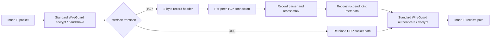
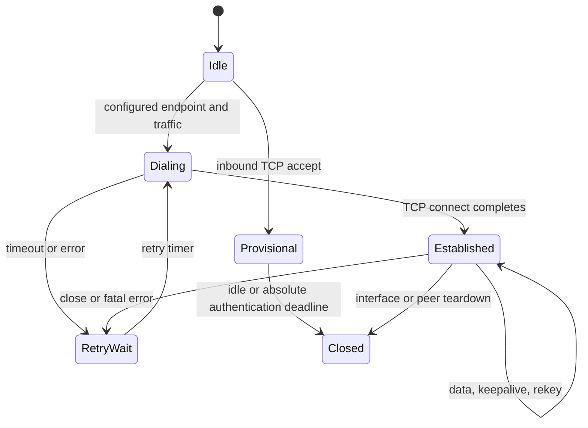

# WireGuard TCP Transport Design

## Document status

| Field | Value |
|---|---|
| Implementation snapshot | `jnathan/naked_gun@4211b00ef437`, imported into this repository |
| Scope | Linux kernel module, Linux generic-netlink control path, modified `wg` tools |
| Maturity | Experimental research prototype |
| Default transport | UDP |
| TCP interoperability | Requires this extension at both endpoints |

This document separates four kinds of statements:

- **Implemented** describes behavior present in this source snapshot.
- **Required for parity** describes work needed to claim backward-compatible,
  production-quality WireGuard behavior in TCP mode.
- **Measured** describes output published by the repository's performance
  campaign. It does not imply a general performance guarantee.
- **Inferred** describes a hypothesis suggested by measured output but not yet
  established causally.

## Executive summary

The extension adds an interface-wide transport selector below WireGuard's
existing cryptographic protocol. In UDP mode, packets follow the retained
WireGuard UDP transport branch. In TCP mode, the same WireGuard handshake,
keepalive, and encrypted data messages are placed into length-delimited records
on a long-lived TCP connection. The receive side removes the record header and
feeds the common WireGuard receive pipeline. When UDP is selected, the
implementation preserves stock random-port binding, handshake-cookie policy,
authenticated endpoint ports and roaming updates, UDP socket ownership, and
stock-facing command output.

The design deliberately does not define a new VPN cryptographic protocol. Noise
handshakes, peer public keys, preshared keys, key rotation, replay protection,
AllowedIPs, and inner-packet authentication remain WireGuard concerns. TCP is an
outer carrier and supplies connection state, ordered delivery, congestion
control, and retransmission.

UDP remains value zero and a fresh interface uses it when `Transport` is absent.
On an existing interface, omission leaves the current mode unchanged. This
preserves configuration at the selection layer, but it is not automatic
protocol fallback. TCP peers do not interoperate with stock UDP-only WireGuard
peers on the same interface. Mixed transports require separate WireGuard
interfaces.

The code contains a bounded foundation for endpoint roaming: it accepts an
inbound TCP connection before its peer identity is known and processes the
normal WireGuard handshake. Provisional entries are capped per device and have
idle and absolute pre-authentication deadlines. The old receive-side promotion
block has been removed; no current path transfers a provisional socket to the
authenticated peer. Responder-only and automatic TCP roaming are therefore
unsupported. Explicitly configured reconnect targeting is separated from
learned endpoints and passed the two-underlay migration and interface-restart
case. Authenticated roaming targets, asymmetric ports, local route changes,
IPv6 validation, and connection-collision handling require additional work.

TCP listeners and outbound sockets use the WireGuard device's retained creation
namespace. New and reconnected outbound streams use route-selected source
addressing there and carry the device `FwMark`. An isolated IPv4 namespace
tunnel is covered at runtime. Live `FwMark`, route, and address changes do not
yet force an established stream to reconnect, and full-tunnel policy-routing
behavior still needs a dedicated runtime campaign.

## Goals

1. Carry standard WireGuard messages over raw TCP when UDP is unavailable or
   operationally undesirable.
2. Keep the existing UDP data path available and selected by default.
3. Reuse WireGuard keys, Noise handshakes, AllowedIPs, replay protection,
   keepalives, rekey timers, and peer statistics.
4. Support initiator, responder, NATed, endpoint-learning, and roaming roles in
   TCP mode without trusting an address before cryptographic authentication.
5. Integrate outer-TCP flow control without blocking softirq or WireGuard crypto
   workers.
6. Make nested-TCP behavior observable and bounded so congestion cannot cause
   unbounded kernel queues or silent stalls.

## Non-goals

- Making a TCP-mode peer wire-compatible with a stock UDP-only peer.
- Disguising the stream as HTTP, TLS, or another application protocol.

## Architecture



The selector is stored on `struct wg_device`, so every peer on one interface
uses the same carrier. The UDP implementation remains present and the send path
branches immediately before outer transport transmission. See
[`device.h`](../kernel/device.h#L62-L90),
[`device.c`](../kernel/device.c#L37-L77), and
[`socket.c`](../kernel/socket.c#L1200-L1282).

### Control plane

The UAPI adds two values and one device attribute:

```c
#define WG_TRANSPORT_UDP 0
#define WG_TRANSPORT_TCP 1

enum wgdevice_attribute {
    /* existing attributes retain their numbers */
    WGDEVICE_A_PEERS,
    WGDEVICE_A_TRANSPORT,
};
```

`WGDEVICE_A_TRANSPORT` is appended after the stock attributes and encoded as
`NLA_U8`; the generic-netlink family remains version 1. The kernel returns the
value on device dumps. The modified Linux `wg` tool sends the attribute only
when its separate `WGDEVICE_HAS_TRANSPORT` flag is set. References:

- [`include/uapi/linux/wireguard.h`](../include/uapi/linux/wireguard.h#L131-L166)
- [`kernel/netlink.c`](../kernel/netlink.c#L29-L39)
- [`kernel/netlink.c`](../kernel/netlink.c#L525-L531)
- [`tools/containers.h`](../tools/containers.h#L69-L92)
- [`tools/ipc-linux.h`](../tools/ipc-linux.h#L469-L483)

The configuration file key is interface-wide and case-insensitive:

```ini
[Interface]
PrivateKey = <private-key>
ListenPort = 51821
Transport = tcp

[Peer]
PublicKey = <peer-public-key>
AllowedIPs = 10.0.0.2/32
Endpoint = peer.example.net:51821
PersistentKeepalive = 25
```

The equivalent direct command is:

```bash
wg set wg0 listen-port 51821 transport tcp
```

Both endpoints need the modified kernel and must select the same transport for
TCP. In either mode, an omitted or zero `ListenPort` is resolved to a random port
at interface-up. In TCP mode the companion UDP socket binds first, records the
concrete port, and the TCP listener then binds that same number. If TCP listener
creation fails, interface-up releases the UDP sockets and restores the requested
port so a later retry can select again. Configure the transport while the
interface is down and has no peers; live mode switching is rejected until
carrier transitions are transactional. TCP listen-port changes also require the
interface to be down and return `EBUSY` without disturbing active listeners.
The regression mode guard confirms that a rejected live update leaves both
listeners present, then confirms that a link-down port-zero reconfiguration
selects one random port shared by the TCP listener and companion UDP socket.

For the current static topology, both peers need bidirectional inbound TCP
reachability or port forwarding on matching configured ports. The handshake
path can initiate a reverse connection instead of replying solely on the
accepted stream, so conventional one-sided client-behind-NAT behavior is not
established. A replacement configuration may change transport while link-down
because it removes the old peers before creating peers for the new carrier.

TCP mode also opens the normal WireGuard UDP sockets on the same numeric
`ListenPort` as the TCP listener. Operators seeking TCP-only exposure must block
that UDP port at the firewall. On a TCP-mode interface, handshakes delivered
through either carrier bypass the inexpensive MAC1/cookie screen and proceed to
Noise processing. Noise authentication remains authoritative, so this is
pre-authentication CPU/resource denial-of-service exposure rather than an
authentication bypass.

### TCP record format

TCP does not preserve message boundaries, so each WireGuard message is wrapped
in a small record:

| Offset | Size | Field | Meaning |
|---:|---:|---|---|
| 0 | 4 | `length` | Big-endian total record length, including this header |
| 4 | 1 | `type` | Record type; current data path uses `0` |
| 5 | 1 | `flags` | Bit 0 indicates a fragment metadata header |
| 6 | 2 | `checksum` | Framing checksum over length, type, and flags |
| 8 | 0 or 4 | fragment metadata | IPv4 ID and fragment offset when flag bit 0 is set |
| 8 or 12 | variable | payload | Unmodified WireGuard message |

The definitions are in [`socket.h`](../kernel/socket.h#L36-L58). The checksum
is an XOR/rotate discriminator with a fixed constant, implemented in
[`socket.c`](../kernel/socket.c#L3222-L3251). It helps locate record boundaries;
it is not a MAC and must never be treated as authentication. Only the enclosed
WireGuard message receives cryptographic authentication.

### Transmit path

1. The normal WireGuard path selects a peer by AllowedIPs, creates or refreshes
   its Noise session, encrypts the inner packet, and produces a standard
   WireGuard message.
2. UDP mode calls the existing IPv4 or IPv6 UDP tunnel transmitter.
3. TCP mode builds one contiguous record containing the header, optional
   fragment metadata, and complete WireGuard payload, then appends it to the
   peer's bounded send queue.
4. Only the per-peer write worker calls nonblocking `kernel_sendmsg`. It advances
   the same queued byte sequence after a short write and requeues the exact
   suffix; it never emits a second header or retransmits an emitted prefix.
5. A full socket buffer returns `EAGAIN`; `sk_write_space` schedules the worker
   to continue draining queued records when the TCP stack has room. A full
   1024-frame queue rejects the newest record so a partially emitted head is
   never discarded.
6. `TCP_NODELAY` is enabled on accepted and outbound sockets to avoid Nagle and
   delayed-ACK latency amplification.

The record write path is in
[`socket.c`](../kernel/socket.c#L1114-L1262), and callback-driven draining is in
[`socket.c`](../kernel/socket.c#L3383-L3505) and
[`socket.c`](../kernel/socket.c#L4273-L4325).

### Receive path

1. `sk_data_ready` schedules a per-peer read worker instead of performing
   blocking stream I/O in the socket callback.
2. The worker accumulates arbitrary TCP chunks until an entire record is
   available.
3. It checks the framing checksum, rejects unknown type or flag values, enforces
   the WireGuard-message minimum and `WG_MAX_PACKET_SIZE`, handles an optional
   fragment header, and preserves leftover bytes when one receive contains
   multiple records. The same validation is used while resynchronizing.
4. It reconstructs synthetic IP and UDP headers from the TCP socket's endpoints.
   This lets the existing WireGuard receive code obtain endpoint metadata and
   reuse the normal handshake/data dispatch.
5. The standard WireGuard pipeline authenticates the handshake or AEAD data,
   performs replay checks, applies AllowedIPs, updates timers, and only then
   delivers the inner packet.

See [`socket.c`](../kernel/socket.c#L3850-L4209),
[`socket.c`](../kernel/socket.c#L3650-L3846), and
[`receive.c`](../kernel/receive.c#L908-L960).

## Target connection lifecycle



This is the implemented lifecycle. A device retains at most 128 provisional
entries. Activity refreshes a five-second idle deadline, while a separate
30-second maximum lifetime prevents a trickle sender from retaining a slot
forever. A one-second sweep claims an expired list entry under the device lock,
waits for RCU readers, quiesces its callbacks and workers, and then releases the
socket. Authentication does not currently promote that socket.

### Outbound connections

The module creates a nonblocking kernel TCP socket, installs its callbacks,
starts `kernel_connect`, and arms a retry worker. State changes update
`tcp_pending`, `tcp_established`, inbound/outbound direction flags, and
timestamps. A close schedules cleanup and a later reconnect when no usable
direction remains. Every connect failure uses one unwind path that detaches
callbacks and `sk_user_data`, clears both published socket aliases and state,
and only then releases the socket. See [`socket.c`](../kernel/socket.c#L2471-L2693),
[`socket.c`](../kernel/socket.c#L2792-L2984), and
[`socket.c`](../kernel/socket.c#L4462-L4503).

### Inbound connections and identity

An address is not a WireGuard identity. The listener therefore accepts a TCP
connection from an unknown source into a temporary peer object. That object has
only the stream parser, queues, callbacks, and enough device context to process
a WireGuard handshake. The receive path deliberately does not own or delete
provisional list entries and does not adopt an arbitrary `skb->sk` socket.
During TCP handshake processing, only a socket already owned by the configured
peer can refresh that peer's activity; received TCP metadata does not invoke
the UDP endpoint-learning hook. A future responder-only design needs a new,
explicitly synchronized transfer protocol before NAT or automatic TCP roaming
can be supported.

The provisional accept and cleanup paths are in
[`socket.c`](../kernel/socket.c). The transport-gated handshake endpoint logic
is in [`receive.c`](../kernel/receive.c).

### Concurrency model

Each real or temporary peer owns read/write work items, scheduling locks, TCP
state locks, and a send queue. Socket callbacks remain short; stream reads and
writes run on workqueues. Pending accepted sockets are held on a device list
protected by a spinlock and RCU operations. Claiming removes the entry once;
the claimant is the sole owner that quiesces and destroys it. See
[`peer.h`](../kernel/peer.h#L60-L116) and
[`socket.c`](../kernel/socket.c#L4506-L4700).

## Backward compatibility contract

### Implemented behavior

| Combination | Result |
|---|---|
| Modified tool + modified kernel, no `Transport` | Existing mode is not explicitly changed; a new device starts as UDP |
| Modified tool + modified kernel, `Transport = udp` | Stock-facing UDP port, cookie, endpoint, socket, and output semantics are selected |
| Modified tool + modified kernel, `Transport = tcp` | TCP record transport is selected for the entire interface |
| Stock-style config on modified tool/kernel | Existing keys remain valid; omission gives UDP on a fresh device and preserves the current mode on an existing one |
| Stock tool + modified kernel | Official stock `wg` ignores the appended dump attribute and controls UDP normally |
| Modified tool + stock kernel, transport omitted | No new SET attribute is sent; stock UDP behavior is retained |
| Modified tool + stock kernel, explicit UDP | Capability preflight omits the unsupported attribute as a UDP no-op |
| Modified tool + stock kernel, explicit TCP | Capability preflight returns `EOPNOTSUPP` before applying the request |
| Stock peer opposite a TCP interface | No interoperability; there is no transport negotiation |
| TCP and UDP peers on one interface | Not supported; use two interfaces |

Compatibility comes from appending the UAPI attribute, retaining family version
1, assigning UDP value zero, omitting the attribute from ordinary SET requests,
and retaining stock output columns. The modified kernel emits the attribute in
device dumps for capability detection; official stock `wg` ignores unknown dump
attributes. Third-party controllers that reject additive attributes still need
their own compatibility validation.

### UDP compatibility fixes

- New UDP interfaces start with port zero and obtain a random port on link-up.
- Under load, a valid MAC1 without a valid cookie receives the stock cookie
  challenge instead of entering expensive Noise processing directly.
- Authenticated endpoint updates retain the peer's observed remote port; TCP
  bookkeeping cannot replace it with the local listen port in UDP mode.
- UDP sockets store the device directly in `sk_user_data`, matching stock
  ownership and avoiding a wrapper leak on port changes.
- IPv4 and IPv6 UDP sends retain the stock self-route guard and return `-ELOOP`
  rather than recursively sending an outer packet through the same WireGuard
  device.
- A UDP send without a configured endpoint retains the stock
  `-EAFNOSUPPORT` result.
- TCP workqueues, collision policy, fragmentation metadata, packet decoding,
  and namespace-specific stream sockets are gated away from UDP operation.
- Release `wg` output is quiet and retains the stock human, `showconf`, and
  `dump` shape. `wg show INTERFACE transport` provides explicit mode discovery.
- A DEBUG-gated kernel selftest covers the cookie-policy truth table, and
  `tests/udp-compat-netns.sh` covers random ports, stock tools, output shape,
  bidirectional UDP traffic, and a TCP tunnel over a namespace-only underlay.

The brokered 2026-07-12 Ubuntu 24.04 Hyper-V run `wg20260712T212739Z` passed all
16 combinations of stock/fork kernels and stock/fork tools, plus the focused UDP
namespace, roaming, random-port, output, capability, and mode-guard cases: **26
PASS, 0 FAIL, 0 SKIP** in 208.713 seconds across 433 logged commands. The mode
guard rejected a live TCP listen-port change with `EBUSY` while both listeners
remained present, then used a link-down port-zero reconfiguration to select the
same random port for TCP and its companion UDP socket. The tested source
snapshot used base commit `35c9110cac0f10a6f6481d5d25d8cc6d5989918a` and
provisioned overlay SHA-256
`e19ba9759f2636849290a2773b2c5f764cd974437d94d745e837a69ee26e151c`.
See the [recorded results](../tests/hyperv/RESULTS.md). This establishes drop-in
compatibility for the tested Linux combinations; third-party controllers and
other kernel releases still require their own validation. The source-contract
checks exercise framing and lifecycle invariants, but this campaign does not
constitute hostile malformed-stream, forced-short-write, or queue-exhaustion
pressure testing.

### Remaining TCP parity and production work

1. **Make transitions transactional.** A live UDP-to-TCP or TCP-to-UDP change
   must create the new listeners and peer state before committing the mode, then
   tear down the old carrier. The kernel currently rejects live changes.
2. **Validate configuration workflows.** The canonical `Transport` output,
   legacy `TransportMode` input alias, capability preflight, manual page,
   completion, and show selector are implemented but still need full
   `showconf`/`setconf`/`syncconf`/`wg-quick SaveConfig` integration testing.
3. **Complete routing-change semantics.** New TCP sockets carry `FwMark` in the
   device creation namespace; validate full-tunnel rules and reconnect active
   streams after live mark, route, or source-address changes.
4. **Broaden namespace validation.** The isolated IPv4 tunnel passes; add IPv6,
   namespace teardown, device-move, and VRF coverage.
5. **Adjust MTU accounting.** Include TCP/IP plus the 8-byte record overhead in
   automatic MTU selection and test fragmentation for IPv4 and IPv6.
6. **Redact kernel debug output.** Userspace raw netlink dumps and trace output
   have been removed. Kernel `WG_TCP_VERBOSE` paths can still expose keys or
   plaintext and must be redacted before hostile or production use.

Current examples of these gaps are visible in
[`showconf.c`](../tools/showconf.c#L52-L69),
[`netlink.c`](../kernel/netlink.c#L832-L909),
[`socket.c`](../kernel/socket.c#L2349-L2354),
[`socket.c`](../kernel/socket.c#L2550-L2668), and
[`ipc-linux.h`](../tools/ipc-linux.h#L451-L483).

## Roaming and endpoint mobility

WireGuard roaming means that peer identity is stable while the observed network
endpoint can change. A valid packet from the peer's key may update the endpoint;
the address itself never authenticates the peer.

### Implemented foundation

- UDP handshake and data processing retains the stock authenticated
  endpoint-learning hooks.
- TCP configured dial targets are updated only by explicit netlink
  configuration, not by synthetic receive metadata.
- Unknown inbound TCP addresses are admitted provisionally under a 128-entry
  per-device cap, a five-second idle deadline, and a 30-second absolute
  pre-authentication lifetime.
- TCP handshake receive can refresh activity only for an inbound or outbound
  socket already owned by the authenticated peer. Socket promotion is absent.
- Route cache state is reset when an endpoint changes.
- Existing keepalive and rekey timers operate above the transport selector.

References:
[`receive.c`](../kernel/receive.c#L487-L536),
[`receive.c`](../kernel/receive.c#L908-L935), and
[`socket.c`](../kernel/socket.c#L1408-L1472).

### Current parity status

| Scenario | Current status | Work needed for full parity |
|---|---|---|
| Static IPv4 endpoint | Cross-host smoke and stock-tool management passed | Soak, reconnect, and failure-injection tests |
| Static IPv6 endpoint | Independent v4/v6 listeners implemented | Run the IPv6 and dual-stack campaign |
| Responder with newly observed source | Unsupported; provisional sockets are bounded but never promoted | Design authenticated promotion with explicit lifetime/RCU/socket ownership transfer |
| NAT with persistent keepalive | Standard timer retained | Validate long-lived TCP NAT behavior and half-open detection |
| Configured peer IP changes | Two-underlay migration with both interfaces restarted passed | Test repeated churn, failure injection, and long-duration operation |
| Authenticated peer IP changes | Unsupported | Implement safe promotion and update future dial targets only after authentication |
| Peer source port changes | Observed by accepted socket | Keep ephemeral source separate from remote listen port |
| Asymmetric listen ports | Not robust | Preserve configured peer port; never replace it with the local port |
| Local uplink/address changes | Not robust | Route/address notifiers and socket reconnect in the correct namespace |
| TCP network namespaces | Isolated IPv4 tunnel passed | Add IPv6, namespace teardown, device-move, and VRF coverage |
| TCP full-tunnel policy routing | New streams inherit `FwMark`; runtime policy campaign absent | Validate recursion avoidance and reconnect after live mark changes |
| Simultaneous inbound/outbound connect | Both directions tracked | Deterministic collision winner and graceful old-stream drain |
| Mixed TCP/UDP peers | Not supported per interface | Separate interfaces, or a future per-peer UAPI revision |

Explicit netlink endpoint configuration now calls
`wg_socket_set_peer_endpoint_configured()`. It replaces `peer_endpoint` on every
configured change and shuts down an active outbound stream; the existing close
and retry workers then own cleanup and dial the new target. In contrast,
authenticated endpoint learning through `wg_socket_set_peer_endpoint_from_skb()`
updates observed/reply state without changing the configured dial target. This
separation prevents ordinary receive traffic from silently rewriting operator
configuration.

Run `wg20260712T212739Z` completed with **26 PASS, 0 FAIL, 0 SKIP**. Its
configured-migration case changed both endpoints from `path0` to `path1`,
disabled the original underlay, cycled both WireGuard interfaces down and up,
and recovered bidirectional tunnel traffic over the replacement TCP path. That
validates this explicit, operator-configured IPv4 migration and
interface-restart sequence. It does not validate responder-only establishment,
automatic authenticated roaming, route/address notification, NAT, or repeated
path churn. Those cases remain unsupported or unvalidated because safe
provisional promotion and an authenticated dial-target policy are not
implemented. See the [regression results](../tests/hyperv/RESULTS.md). Relevant
state handling is in [`socket.c`](../kernel/socket.c#L1428-L1516) and
[`netlink.c`](../kernel/netlink.c#L746-L757).

### Target roaming algorithm

1. Accept a TCP stream into a small, rate-limited provisional object with a
   handshake deadline and strict byte/frame limits.
2. Permit only valid WireGuard handshake records before peer authentication.
3. Let Noise map the handshake to a configured public key.
4. Split endpoint state into:
   - live TCP 4-tuple,
   - last authenticated remote IP/family,
   - configured remote listen port,
   - last valid local route/source,
   - current active connection generation.
5. Atomically promote the socket to the peer. A deterministic rule based on
   connection generation and peer keys must resolve simultaneous connections.
6. Update the dial IP only from an authenticated message. Preserve the configured
   peer listen port unless an authenticated protocol extension explicitly
   advertises a replacement.
7. Drain and retire the old stream without discarding valid Noise keypairs.
8. On local route/address changes, discard stale source state and reconnect via
   the current route in the device's namespace.
9. Keep `PersistentKeepalive`, rekey, replay, and AllowedIPs semantics unchanged.

## Security model

### Preserved properties

- Peer identity is still a WireGuard public key.
- Handshake and data authentication remain Noise and ChaCha20-Poly1305 concerns.
- Replay counters and AllowedIPs validation remain in the common receive path.
- TCP framing does not weaken or replace the WireGuard cryptographic envelope.

### New attack surface

TCP adds unauthenticated connection state before a WireGuard identity is known.
The implementation must defend memory, CPU, workqueue, and file-descriptor
resources before Noise authentication.

Implemented controls include:

- Enforce WireGuard-message and fragment minimums,
  `record_length <= WG_MAX_PACKET_SIZE`, and known type/flag values before a
  record-driven allocation. Resynchronization uses the same validator.
- Build a record once and serialize all stream writes through one per-peer
  worker. A short write advances and requeues the exact remaining bytes.
- Cap each peer send queue at 1024 maximum-sized records and reject the newest
  record under pressure, preserving a partially emitted head.
- Cap provisional objects at 128 per device, expire them after five idle
  seconds or 30 total pre-authentication seconds, and retain one
  claim/remove/destroy owner.

Remaining controls include:

- Add per-source or per-prefix accept limits and rate limits so one origin
  cannot monopolize the device-wide provisional allowance.
- Restore an equivalent to WireGuard's cookie/rate-limit protection. TCP mode
  opens TCP and UDP on the same numeric listen port, and handshakes delivered by
  either carrier bypass the inexpensive MAC1/cookie screen. They still require
  successful Noise authentication; the gap increases pre-authentication
  CPU/resource denial-of-service exposure and is not an authentication bypass.
  Operators seeking TCP-only exposure must block the companion UDP port.
- Design temporary-peer promotion before enabling roaming. The unsafe legacy
  block has been removed rather than repaired; no current ownership-transfer
  protocol exists.
- Stress the bounded parser, resynchronization, short-write cursor, and final
  read-worker readiness check under adversarial segmentation and pressure.
- Keep verbose packet/key diagnostics disabled outside an isolated lab. They are
  off by default, but verbose code can expose sensitive material.
- Keep `WG_TCP_VERBOSE` away from production secrets until its key-bearing
  kernel output is redacted. Userspace tool output is now quiet.

These are design-closure requirements, not optional optimizations. Relevant
current paths include [`receive.c`](../kernel/receive.c#L421-L484),
[`socket.c`](../kernel/socket.c#L1114-L1240),
[`socket.c`](../kernel/socket.c#L3626-L3645), and
[`socket.c`](../kernel/socket.c#L3953-L4028).

## TCP-over-TCP behavior and meltdown conditions

### The risk

When an inner TCP flow crosses an outer TCP stream, both layers implement
reliability, ordering, retransmission timers, and congestion response. Loss of
one outer segment blocks delivery of later bytes even when they contain packets
for unrelated inner flows. If outer recovery is slow enough for inner TCP to
time out, both layers can retransmit and reduce their windows. Queue growth and
repeated timeouts are commonly called TCP-over-TCP meltdown.

No design using one reliable ordered stream can make this risk disappear. The
goal is bounded, observable degradation and a clear choice to retain UDP where
its datagram semantics are preferable.

The real-world application tests motivate a more specific working hypothesis:
severe TCP-over-TCP meltdown may be a narrower, path- and workload-dependent
condition than broad warnings first suggest. Harmful interaction may require a
particular conjunction of outer loss or congestion, head-of-line blocking,
enough multiplexed inner traffic and queue growth, and recovery delays long
enough to engage both retransmission timers. The campaign did not impair or
instrument the physical outer TCP carrier, so it neither demonstrates general
meltdown resilience nor locates those boundary conditions.

### Implemented properties that can help

- Linux TCP provides the outer congestion controller, SACK/DSACK behavior when
  negotiated by the host stack, retransmission, pacing, and receive-window
  backpressure.
- `TCP_NODELAY` avoids Nagle/delayed-ACK amplification for small WireGuard
  records.
- Nonblocking writes and `sk_write_space` callbacks keep WireGuard workers from
  sleeping behind a full outer socket.
- Per-peer connections isolate different peers, although all inner flows for one
  peer still share one ordered stream.
- Record framing reassembles TCP segmentation/coalescing, retains multiple
  records from one receive, and preserves a single framed byte sequence across
  nonblocking short writes.
- Connection close/error callbacks schedule cleanup and reconnect.
- Optional diagnostics expose cwnd, ssthresh, RTT, RTO, retransmission state,
  socket memory, and queue pressure. See
  [`socket.c`](../kernel/socket.c#L73-L337).

The module does **not** implement a custom adaptive congestion controller,
four-zone tuning, custom DSACK logic, or coordination between inner and outer
TCP timers. References to such features in the historical test plan are not
backed by symbols in this source snapshot.

### Required controls for bounded behavior

1. **Record-safe backpressure:** the queued skb is the byte cursor across short
   writes; stress it with forced small send buffers and concurrent producers.
2. **Bounded memory:** packet count and maximum record size now bound each peer
   queue, and provisional count/deadlines bound retained pre-auth state. Add
   exported byte/drop high-water marks and broader device budgets.
3. **Congestion signaling:** prefer an intentional early drop policy over an
   unbounded queue so inner TCP can react before memory and latency explode.
4. **Fair scheduling:** prevent one inner flow from monopolizing a peer stream.
   A future multi-lane protocol may isolate flow classes, but it requires an
   explicit interoperable framing revision.
5. **Stall detection:** combine forward-progress time, `TCP_INFO`, queue age,
   and keepalive state to close a stream that is alive but no longer useful.
6. **Connection limits:** per-device caps and expiry are implemented; add
   per-source/prefix accept rate limits and SYN/handshake cost controls.
7. **Observability:** export retransmits, cwnd, RTT/RTO, send/receive queue age,
   partial writes, parser resyncs, reconnects, and per-peer drops.
8. **UDP escape hatch:** keep UDP the default and support separate UDP/TCP
   interfaces so operators can choose datagram semantics for latency-sensitive
   or highly multiplexed traffic.

## Performance evidence

### Published campaign

The published report describes eight isolated two-vCPU Azure VM pairs across
x64 and arm64, four latency tiers, TCP and UDP WireGuard interfaces, four
workload families, eight configured loss values from 0% to 20%, and nominally
three runs per cell. Bulk TCP uses four parallel streams, bulk UDP is capped at
1 Gbps, and loss injection is iid random. Applications also included short
HTTPS, HTTP/2, and ICMP/SSH-oriented interactive tests. See
[`perf-test/REPORT.md`](../perf-test/REPORT.md#L1-L38).

The reported output is surprising:

| Published example | TCP-WG | UDP-WG |
|---|---:|---:|
| LAN x64 bulk TCP, clean | 2789.4 Mbps | 2588.2 Mbps |
| LAN x64 bulk TCP, configured 10% loss | 2751.2 Mbps | 28.8 Mbps |
| HIGH x64 bulk TCP, clean | 244.8 Mbps | 286.1 Mbps |
| HIGH x64 bulk TCP, configured 10% loss | 463.9 Mbps | 0.7 Mbps |
| LAN x64 short HTTPS, configured 10% loss | 154.54 req/s | 6.01 req/s |

The same tables show a mixed clean-link cost: TCP-WG is ahead in several LAN and
medium-distance bulk cells, but x64 is 14% behind at the clean HIGH tier and 23%
behind at the clean MAX tier. Published TCP-WG ICMP loss is zero throughout the
configured loss sweep while UDP-WG approximately follows the configured value.

### Provisional inference

The defensible interpretation is:

> No classic throughput collapse is visible in the published application
> tables, including the 60-second bulk runs, under this campaign's configured
> WireGuard-interface impairment. These real-world application tests support a
> working hypothesis that severe TCP-over-TCP meltdown may be a narrower,
> path- and workload-dependent condition than broad warnings first suggest.

That is a reason to test the hypothesis directly. It does not identify the
necessary or sufficient conditions, and it is not proof that the outer TCP
carrier is generally meltdown-resilient.

### Why it is not an outer-loss proof

The executable harness applies `tc netem` to `wg-tcp0` or `wg-udp0` for tunneled
cases, not to the physical carrier interface:
[`run-cell.sh`](../perf-test/harness/run-cell.sh#L41-L72). The test plan also
describes this as tunnel-internal loss:
[`TESTPLAN.md`](../perf-test/TESTPLAN.md#L182-L189). This conflicts with wording
in the generated report that calls it carrier-link loss.
The harness installs that qdisc only on the client VM/interface, so impairment
was one-sided despite stale test-plan language about both directions.

Consequences:

- Outer TCP segment loss, retransmission, reordering, and cwnd recovery were not
  demonstrably exercised.
- The campaign does not isolate whether the TCP path recovered, bypassed, or
  experienced a different impairment at the WireGuard qdisc.
- Saved artifacts do not include enough qdisc or outer-TCP retransmission data to
  establish a causal explanation.
- Some report/matrix counts and stale topology labels conflict, and the raw cell
  directory is not present for independent regeneration.
- Short-transfer cells can contain up to 600 GETs across three sizes, high-loss
  cells may be partial after the 360-second cap, and the web mix can retry at a
  lower concurrency. A published MAX-arm 0.5% short-transfer cell also has a
  very large spread (69.09 +/- 118.40 requests/s). These details limit direct
  comparison between every reported cell.

There is also negative stability evidence: the report records an arm64,
high-latency, configured 10-20% loss workload that wedged the VM network stack
until reboot; a 360-second workload ceiling avoided the condition rather than
demonstrating a fix. See
[`REPORT.md`](../perf-test/REPORT.md#L493-L514).

### Required meltdown validation

A release claim should require a new, reproducible campaign that:

1. Applies impairment to the physical outer interface and verifies it with
   before/after qdisc counters.
2. Separates random non-congestive loss, burst loss, reordering, delay, bandwidth
   bottlenecks, and finite queue congestion.
3. Captures outer `TCP_INFO`, cwnd, RTT/RTO, SACK/retransmits, socket memory, and
   per-record queue age alongside inner-flow metrics.
4. Tests one and many inner TCP/UDP flows, short requests, interactive traffic,
   flow fairness, and cross-flow head-of-line blocking.
5. Includes blackouts longer than inner and outer RTOs, route changes, reconnect,
   rekey, and endpoint roaming.
6. Runs multi-hour soaks without workload time caps hiding a stall.
7. Stores raw cells, exact scripts, kernel/tool commits, qdisc configuration,
   and aggregate code so every table can be regenerated.
8. Defines failure thresholds for queue growth, latency, kernel warnings, lost
   connectivity, and required reboot, not throughput alone.

## Benefits analysis

| Potential benefit | Best fit | Cost or condition |
|---|---|---|
| Connectivity where UDP is blocked | Networks that permit raw TCP to the configured port | This is not HTTP/TLS camouflage and may still be blocked by policy or DPI |
| Reuse of WireGuard identity and crypto | Operators wanting the same keys, peers, AllowedIPs, rekey, and keepalives | Both endpoints need the modified Linux implementation |
| Potential outer-loss recovery | Non-congestive carrier loss where ordered reliable delivery is valuable | Can add latency and head-of-line blocking; the current campaign does not validate physical-carrier loss |
| Reliable delivery for inner UDP | Bulk or transactional UDP where completeness matters more than timeliness | Changes datagram loss semantics; late data may be worse than dropped data for real-time media |
| Long-lived connection through stateful policy | TCP-friendly firewalls/NATs | Requires connection limits, keepalive validation, and half-open detection |
| Operational choice | Separate TCP and UDP interfaces can serve different routes | Mode is device-wide, with additional configuration and resource cost |

### Recommended transport choice

| Situation | Recommendation |
|---|---|
| UDP works and lowest latency/simple state is the priority | Use UDP |
| UDP is blocked but raw TCP is allowed | Evaluate TCP mode in a controlled deployment |
| Real-time UDP prefers timely loss over delayed recovery | Prefer UDP |
| Random-loss bulk/transactional traffic | Benchmark both modes on the actual path |
| Many unrelated inner flows share one peer | Treat TCP mode as experimental until fairness and pressure stress are complete |
| Production full-tunnel policy routing or complex TCP namespace/VRF layouts | Validate the target rules; live mark/route changes do not reconnect an established stream |
| Production roaming or automatic endpoint mobility | Complete the promotion and reconnect-target parity items first |

## Implementation map

| Area | Primary files |
|---|---|
| Transport UAPI | `include/uapi/linux/wireguard.h`, `tools/uapi/linux/linux/wireguard.h` |
| Kernel device selection | `kernel/device.h`, `kernel/device.c`, `kernel/netlink.c` |
| TCP framing and sockets | `kernel/socket.h`, `kernel/socket.c` |
| Handshake/data integration | `kernel/send.c`, `kernel/receive.c` |
| Peer TCP state | `kernel/peer.h`, `kernel/peer.c` |
| Tool parsing and netlink | `tools/config.c`, `tools/containers.h`, `tools/ipc-linux.h` |
| Display/config output | `tools/show.c`, `tools/showconf.c` |
| Performance methodology | `perf-test/TESTPLAN.md`, `perf-test/harness/`, `perf-test/REPORT.md` |

## Design closure checklist

UDP drop-in compatibility and TCP feature parity are tracked separately below.
The tested UDP path is compatible for the recorded Linux matrix; a complete TCP
parity claim still requires every remaining item.

- [x] On Ubuntu 24.04, the committed suite passes the full 16-way stock/fork
      kernel/tool UDP matrix and focused UDP cases with `Transport` absent or
      explicitly set to UDP. See the [2026-07-12 results](../tests/hyperv/RESULTS.md).
- [x] Static IPv4 TCP traffic, stock-tool management, and an explicit
      two-underlay configured-endpoint migration with interface restart pass in
      the same 26-case campaign.
- [x] Transport values, record sizes, flags, queues, and provisional connections
      are strictly validated and bounded.
- [ ] Partial writes and multi-record reads are stress-tested without stream
      corruption or stalls.
- [ ] Cookies/rate limits and unauthenticated resource controls protect TCP
      accepts before Noise authentication.
- [ ] Static, responder-only, NAT, persistent-keepalive, IP/port roaming,
      simultaneous connect, rekey, and reconnect scenarios pass for IPv4/IPv6.
- [ ] Remote dial IP, remote listen port, observed ephemeral source, and local
      route/source are represented separately.
- [ ] `FwMark`, MTU, route-change, namespace teardown/move, and random-port
      semantics match standard WireGuard expectations across IPv4/IPv6.
- [ ] `wg`, `showconf`, `syncconf`, `wg-quick SaveConfig`, man pages,
      completions, and stable script output round-trip both modes.
- [x] No auxiliary userspace-tool diagnostic output exposes key material or
      corrupts intended tool output.
- [ ] Outer-loss, congestion, multi-flow fairness, roam, and long-soak campaigns
      are reproducible from committed raw data.
- [ ] No workload can wedge networking, grow queues without bound, or require a
      reboot to recover.

## Current deployment guardrails

For this snapshot:

1. Use it only in a controlled test environment.
2. Use Linux kernel-mode WireGuard at both ends.
3. Prefer an explicit, matching TCP listen port for controlled deployments. If
   using zero, read the randomly selected port after interface-up and configure
   the remote endpoint accordingly. Change a TCP listen port only while down.
4. Set `Transport = tcp` before bringing the interface up.
5. Use separate interfaces when UDP fallback or mixed transport is required.
6. Block the companion UDP port at the firewall when the intended exposure is
   TCP-only; both carriers bind the same numeric listen port in TCP mode.
7. Validate `wg-quick SaveConfig` in the target distribution before relying on
   automatic TCP configuration persistence.
8. Namespace-isolated IPv4 TCP now has a runtime smoke test, and new streams use
   the device `FwMark`. Validate full-tunnel rules explicitly; a live mark,
   route, or address change does not force an established stream to reconnect.
9. Do not rely on provisional peer promotion. The unsafe legacy block has been
   removed and no authenticated socket-transfer protocol is implemented.
10. Treat configured migration as validated only for the recorded explicit
    two-underlay IPv4 endpoint change and interface-restart sequence. Do not
    infer automatic roaming, local route/address-change, asymmetric-port, or
    IPv6 runtime parity from it.
11. Keep optional kernel diagnostics off except during isolated debugging;
   `WG_TCP_VERBOSE` can expose secrets and `WG_TCP_DIAG` is unrate-limited and
   can perturb measurements.
12. Treat the published performance tables as leads for replication, not as a
   production SLA or proof of TCP-over-TCP meltdown immunity.
13. Provide bidirectional inbound TCP reachability on matching configured ports;
    do not assume ordinary one-sided NAT/responder behavior.
