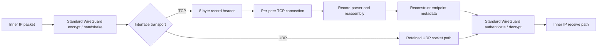
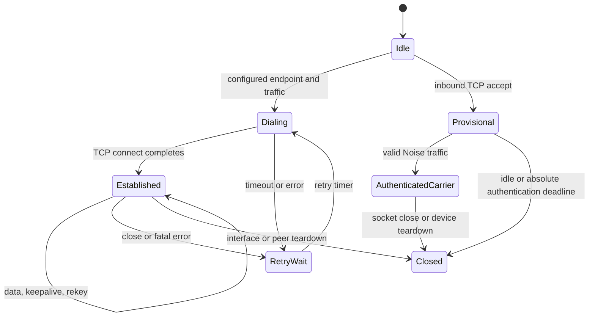

# WireGuard TCP Transport Design

## Document status

| Field | Value |
|---|---|
| Upstream lineage | `jnathan/naked_gun@4211b00ef437`, imported into this repository |
| Full-campaign source | HEAD `83d424cb0191bc2b90090c071728db6348f7b983`; base archive SHA-256 `2de2c670dba76cac01dd1bd35f9de99605d36b032070048d6b94f5e6f3ec0d12`; dirty overlay SHA-256 `40c4db67c0b9660f3589239ca85ac1870d40306075ce67617085a40b1a3d3e9a` |
| Latest full regression | `wg20260714T010310Z`: 36 PASS, 0 FAIL, 0 SKIP; 558.520 seconds; 541 commands |
| Hardened follow-up source | Same HEAD/base archive; dirty overlay SHA-256 `efe576b3c226089de2bbbd23670c599f78a45d8ec315c896cf6c6494a9692dd7` |
| Hardened follow-up | `wg20260713T225629Z`: config reload and hostile-stream PASS; production module restored on both guests |
| NAT44 follow-up | `wg20260714T005957Z`: strengthened guest-local dual-reachable SNAT/DNAT case passed on both guests |
| Scope | Linux kernel module, Linux generic-netlink control path, modified `wg` tools |
| Maturity | Experimental research prototype |
| Default transport | UDP |
| TCP interoperability | Requires this extension at both endpoints |

This document separates four kinds of statements:

- **Implemented** describes behavior present in this source snapshot.
- **Required for parity** describes work needed to claim backward-compatible,
  production-quality WireGuard behavior in TCP mode.
- **Measured** describes output published by the repository's performance
  campaign. It does not imply a general performance guarantee.
- **Inferred** describes a hypothesis suggested by measured output but not yet
  established causally.

## Executive summary

The extension adds an interface-wide transport selector below WireGuard's
existing cryptographic protocol. In UDP mode, packets follow the retained
WireGuard UDP transport branch. In TCP mode, the same WireGuard handshake,
keepalive, and encrypted data messages are placed into length-delimited records
on a long-lived TCP connection. The receive side removes the record header and
feeds the common WireGuard receive pipeline. When UDP is selected, the
implementation preserves stock random-port binding, handshake-cookie policy,
authenticated endpoint ports and roaming updates, UDP socket ownership, and
stock-facing command output.

The design deliberately does not define a new VPN cryptographic protocol. Noise
handshakes, peer public keys, preshared keys, key rotation, replay protection,
AllowedIPs, and inner-packet authentication remain WireGuard concerns. TCP is an
outer carrier and supplies connection state, ordered delivery, congestion
control, and retransmission.

UDP remains value zero and a fresh interface uses it when `Transport` is absent.
On an existing interface, omission leaves the current mode unchanged. This
preserves configuration at the selection layer, but it is not automatic
protocol fallback. TCP peers do not interoperate with stock UDP-only WireGuard
peers on the same interface. Mixed transports require separate WireGuard
interfaces.

The code contains a bounded foundation for endpoint mobility. It accepts an
inbound TCP connection before peer identity is known, applies device and
per-source caps plus per-source throttling, and processes the normal WireGuard
handshake. After valid Noise traffic, the code uses the packet's device-local
connection ID to mark a matching tracked carrier and release its
pre-authentication accounting. That lookup is not yet an atomic peer binding
and cannot report failure to endpoint learning. The configured peer listen port
is stored separately and is never replaced by an accepted socket's ephemeral
source port. Device-monotonic carrier IDs suppress older local observations;
they are not shared collision tokens.

No current path transfers ownership of a provisional accepted socket to the
configured peer. General responder-only roaming and NAT ephemeral-port parity
therefore remain unsupported even though authenticated target learning,
asymmetric configured listen ports, and a 40-second authenticated-carrier
lifetime passed at runtime. A deterministic public-key tie-break resolves
simultaneous TCP Noise initiation ownership, but it is not a substitute for an
authenticated socket-promotion protocol.

TCP listeners, accepted sockets, and outbound sockets use the WireGuard
device's retained creation namespace and carry the device `FwMark`. Route,
netdevice, address, and live-mark changes queue safe reconnect work for affected
established streams. The Ubuntu 24.04/Linux 6.8 campaign passed independent
IPv4/IPv6 listeners, bidirectional ULA and scoped link-local IPv6 TCP traffic,
full-tunnel recursion avoidance, and live `FwMark`, route, source-address, and
uplink reconnects. Namespace teardown/move and VRF behavior remain untested.

## Goals

1. Carry standard WireGuard messages over raw TCP when UDP is unavailable or
   operationally undesirable.
2. Keep the existing UDP data path available and selected by default.
3. Reuse WireGuard keys, Noise handshakes, AllowedIPs, replay protection,
   keepalives, rekey timers, and peer statistics.
4. Support initiator, responder, NATed, endpoint-learning, and roaming roles in
   TCP mode without trusting an address before cryptographic authentication.
5. Integrate outer-TCP flow control without blocking softirq or WireGuard crypto
   workers.
6. Make nested-TCP behavior observable and bounded so congestion cannot cause
   unbounded kernel queues or silent stalls.

## Non-goals

- Making a TCP-mode peer wire-compatible with a stock UDP-only peer.
- Disguising the stream as HTTP, TLS, or another application protocol.

## Architecture



The selector is stored on `struct wg_device`, so every peer on one interface
uses the same carrier. The UDP implementation remains present and the send path
branches immediately before outer transport transmission. See
[`device.h`](../kernel/device.h#L62-L90),
[`device.c`](../kernel/device.c#L37-L77), and
[`socket.c`](../kernel/socket.c#L1200-L1282).

### Control plane

The UAPI adds two values and one device attribute:

```c
#define WG_TRANSPORT_UDP 0
#define WG_TRANSPORT_TCP 1

enum wgdevice_attribute {
    /* existing attributes retain their numbers */
    WGDEVICE_A_PEERS,
    WGDEVICE_A_TRANSPORT,
};
```

`WGDEVICE_A_TRANSPORT` is appended after the stock attributes and encoded as
`NLA_U8`; the generic-netlink family remains version 1. The kernel returns the
value on device dumps. The modified Linux `wg` tool sends the attribute only
when its separate `WGDEVICE_HAS_TRANSPORT` flag is set. References:

- [`include/uapi/linux/wireguard.h`](../include/uapi/linux/wireguard.h#L131-L166)
- [`kernel/netlink.c`](../kernel/netlink.c#L29-L39)
- [`kernel/netlink.c`](../kernel/netlink.c#L525-L531)
- [`tools/containers.h`](../tools/containers.h#L69-L92)
- [`tools/ipc-linux.h`](../tools/ipc-linux.h#L469-L483)

The configuration file key is interface-wide and case-insensitive:

```ini
[Interface]
PrivateKey = <private-key>
ListenPort = 51821
Transport = tcp

[Peer]
PublicKey = <peer-public-key>
AllowedIPs = 10.0.0.2/32
Endpoint = peer.example.net:51821
PersistentKeepalive = 25
```

The equivalent direct command is:

```bash
wg set wg0 listen-port 51821 transport tcp
```

Both endpoints need the modified kernel and must select the same transport for
TCP. In either mode, an omitted or zero `ListenPort` is resolved to a random port
at interface-up. In TCP mode the companion UDP socket binds first, records the
concrete port, and the TCP listener then binds that same number. If TCP listener
creation fails, interface-up releases the UDP sockets and restores the requested
port so a later retry can select again. Configure the transport while the
interface is down and has no peers; live mode switching is rejected until
carrier transitions are transactional. TCP listen-port changes also require the
interface to be down and return `EBUSY` without disturbing active listeners.
The regression mode guard confirms that a rejected live update leaves both
listeners present, then confirms that a link-down port-zero reconfiguration
selects one random port shared by the TCP listener and companion UDP socket.

Both peers need bidirectional inbound TCP reachability or an explicit port
forward to each peer's configured listen port. The ports may differ;
asymmetric listen ports passed in the recorded campaign. Focused run
`wg20260714T005957Z` also passed a guest-local, dual-reachable NAT44 topology:
the private peer listened on `10.240.0.2:52221`, the router DNATed public
`192.0.2.1:52241` to that configured listener, and the private peer's outbound
connection to `192.0.2.2:52220` was SNATed first to source port `41001` and then
to `41002` after the test flushed conntrack and replaced the SNAT rule. Both
peers used two-second persistent keepalives, transfer counters advanced in both
directions, and bidirectional tunneled pings recovered after the translation
change. The public peer's configured dial port remained `52241`; neither
observed SNAT source port replaced it. A live mark change then forced the
public peer's outbound reconnect owner to dial again, and the router counted a
new SYN through the preserved `52241` forward before traffic was revalidated.

This is deliberately a narrow result. The topology gave the private peer an
explicit inbound DNAT, so both peers remained independently dialable. The
handshake path can initiate a reverse connection instead of replying solely on
the accepted stream. Conventional responder-only operation behind NAT, with no
inbound forward, still requires authenticated accepted-socket promotion and is
unsupported. The run also retained the server's stale accepted `41001` carrier
after the replacement `41002` carrier was established. Recovery therefore does
not establish duplicate-carrier retirement, arbitrary NAT roaming, or general
NAT parity. A replacement configuration may change transport while link-down
because it removes the old peers before creating peers for the new carrier.

TCP mode also opens the normal WireGuard UDP sockets on the same numeric
`ListenPort` as the TCP listener. Operators seeking TCP-only exposure must block
that UDP port at the firewall. On a TCP-mode interface, handshakes delivered
through either carrier bypass the inexpensive MAC1/cookie screen and proceed to
Noise processing. Noise authentication remains authoritative, so this is
pre-authentication CPU/resource denial-of-service exposure rather than an
authentication bypass.

### TCP record format

TCP does not preserve message boundaries, so each WireGuard message is wrapped
in a small record:

| Offset | Size | Field | Meaning |
|---:|---:|---|---|
| 0 | 4 | `length` | Big-endian total record length, including this header |
| 4 | 1 | `type` | Record type; current data path uses `0` |
| 5 | 1 | `flags` | Bit 0 indicates a fragment metadata header |
| 6 | 2 | `checksum` | Framing checksum over length, type, and flags |
| 8 | 0 or 4 | fragment metadata | IPv4 ID and fragment offset when flag bit 0 is set |
| 8 or 12 | variable | payload | Unmodified WireGuard message |

The definitions are in [`socket.h`](../kernel/socket.h#L36-L58). The checksum
is an XOR/rotate discriminator with a fixed constant, implemented in
[`socket.c`](../kernel/socket.c#L3222-L3251). It helps locate record boundaries;
it is not a MAC and must never be treated as authentication. Only the enclosed
WireGuard message receives cryptographic authentication.

### Transmit path

1. The normal WireGuard path selects a peer by AllowedIPs, creates or refreshes
   its Noise session, encrypts the inner packet, and produces a standard
   WireGuard message.
2. UDP mode calls the existing IPv4 or IPv6 UDP tunnel transmitter.
3. TCP mode builds one contiguous record containing the header, optional
   fragment metadata, and complete WireGuard payload, then appends it to the
   peer's bounded send queue.
4. Only the per-peer write worker calls nonblocking `kernel_sendmsg`. It advances
   the same queued byte sequence after a short write and requeues the exact
   suffix; it never emits a second header or retransmits an emitted prefix.
5. The worker attempts the nonblocking send instead of stopping on a pre-send
   writeability hint. A full socket buffer returns `EAGAIN`; the exact retained
   frame is requeued before `SOCK_NOSPACE` is armed. A memory barrier plus the
   final scheduler/lifetime-lock writeability recheck prevents a transition from
   being missed, and `sk_write_space` schedules later draining without busy
   looping. A full 1024-frame queue rejects the newest record so a partially
   emitted head is never discarded.
6. `TCP_NODELAY` is enabled on accepted and outbound sockets to avoid Nagle and
   delayed-ACK latency amplification.

The record write path is in
[`socket.c`](../kernel/socket.c#L1114-L1262), and callback-driven draining is in
[`socket.c`](../kernel/socket.c#L3383-L3505) and
[`socket.c`](../kernel/socket.c#L4273-L4325).

### Receive path

1. `sk_data_ready` schedules a per-peer read worker instead of performing
   blocking stream I/O in the socket callback.
2. The worker accumulates arbitrary TCP chunks until an entire record is
   available.
3. It checks the framing checksum, rejects unknown type or flag values, enforces
   the WireGuard-message minimum and `WG_MAX_PACKET_SIZE`, handles an optional
   fragment header, and preserves leftover bytes when one receive contains
   multiple records. Complete buffered leftovers are drained before another
   nonblocking socket read, and bounded worker batches reschedule themselves
   while buffered records remain. Resynchronization uses the same validation,
   retains at most seven bytes that could prefix a header split across reads,
   and lets the ordinary reader append later bytes instead of issuing a second
   one-shot socket read.
4. It reconstructs synthetic IP and UDP headers from the live socket captured by
   the read worker. This preserves connected source ports and IPv6 tuples while
   letting the existing WireGuard receive code obtain endpoint metadata and
   reuse the normal handshake/data dispatch.
5. The standard WireGuard pipeline authenticates the handshake or AEAD data,
   performs replay checks, applies AllowedIPs, updates timers, and only then
   delivers the inner packet.

See [`socket.c`](../kernel/socket.c#L3850-L4209),
[`socket.c`](../kernel/socket.c#L3650-L3846), and
[`receive.c`](../kernel/receive.c#L908-L960).

## Target connection lifecycle



This is the implemented lifecycle. A device retains at most 128 unauthenticated
provisional entries and at most eight from one source. A fixed-size source table
permits a burst of 32 accepts per one-second window before throttling that
source. Activity refreshes a five-second idle deadline, while a separate
30-second maximum lifetime prevents a trickle sender from retaining a slot
forever before authentication. A valid authenticated packet releases admission
accounting and exempts that exact carrier from the pre-authentication deadlines;
the runtime campaign held the same authenticated tuples for 40 seconds. A
one-second sweep claims an expired list entry under the device lock, waits for
RCU readers, quiesces its callbacks and workers, and then releases the socket.
Authentication still does not transfer that socket to the configured peer.

### Outbound connections

The module creates a nonblocking kernel TCP socket, installs its callbacks,
starts `kernel_connect`, and arms a retry worker. State changes update
`tcp_pending`, `tcp_established`, inbound/outbound direction flags, and
timestamps. A close schedules cleanup and a later reconnect when no usable
direction remains. Every connect failure uses one unwind path that detaches
callbacks and `sk_user_data`, clears both published socket aliases and state,
and only then releases the socket. Reconnect requests are queue-only so they are
safe from authenticated receive/NAPI context; teardown claims the exact socket
being removed and a stopping barrier prevents retry work from resurrecting a
peer during interface or device shutdown. See [`socket.c`](../kernel/socket.c#L2471-L2693),
[`socket.c`](../kernel/socket.c#L2792-L2984), and
[`socket.c`](../kernel/socket.c#L4462-L4503).

### Inbound connections and identity

An address is not a WireGuard identity. The listener therefore accepts a TCP
connection from an unknown source into a temporary peer object. That object has
only the stream parser, queues, callbacks, and enough device context to process
a WireGuard handshake. The receive path deliberately does not own or delete
provisional list entries and does not adopt an arbitrary `skb->sk` socket.
A valid Noise-authenticated packet carries a device-local connection ID used
to attempt a tracked-carrier authentication mark and can update the configured
peer's future dial IP. The current void lookup does not atomically bind that
carrier to the peer or make endpoint learning conditional on a successful
claim. It cannot replace the configured remote listen port with the observed
ephemeral TCP source port. A future responder-only design still needs a new,
explicitly synchronized ownership-transfer protocol before general NAT roaming
can be supported.

The provisional accept and cleanup paths are in
[`socket.c`](../kernel/socket.c). The transport-gated handshake endpoint logic
is in [`receive.c`](../kernel/receive.c).

### Concurrency model

Each real or temporary peer owns read/write work items, scheduling locks, TCP
state locks, and a send queue. Socket callbacks remain short; stream reads and
writes run on workqueues. Pending accepted sockets are held on a device list
protected by a spinlock and RCU operations. Claiming removes the entry once;
the claimant is the sole owner that quiesces and destroys it. Cleanup cannot
claim a newly published entry until the listener finishes installing callbacks,
checking queued data, and releasing its initialization handoff. See
[`peer.h`](../kernel/peer.h#L60-L116) and
[`socket.c`](../kernel/socket.c#L4506-L4700).

## Backward compatibility contract

### Implemented behavior

| Combination | Result |
|---|---|
| Modified tool + modified kernel, no `Transport` | Existing mode is not explicitly changed; a new device starts as UDP |
| Modified tool + modified kernel, `Transport = udp` | Stock-facing UDP port, cookie, endpoint, socket, and output semantics are selected |
| Modified tool + modified kernel, `Transport = tcp` | TCP record transport is selected for the entire interface |
| Stock-style config on modified tool/kernel | Existing keys remain valid; omission gives UDP on a fresh device and preserves the current mode on an existing one |
| Stock tool + modified kernel | Official stock `wg` ignores the appended dump attribute and controls UDP normally |
| Modified tool + stock kernel, transport omitted | No new SET attribute is sent; stock UDP behavior is retained |
| Modified tool + stock kernel, explicit UDP | Capability preflight omits the unsupported attribute as a UDP no-op |
| Modified tool + stock kernel, explicit TCP | Capability preflight returns `EOPNOTSUPP` before applying the request |
| Stock peer opposite a TCP interface | No interoperability; there is no transport negotiation |
| TCP and UDP peers on one interface | Not supported; use two interfaces |

Compatibility comes from appending the UAPI attribute, retaining family version
1, assigning UDP value zero, omitting the attribute from ordinary SET requests,
and retaining stock output columns. The modified kernel emits the attribute in
device dumps for capability detection; official stock `wg` ignores unknown dump
attributes. Third-party controllers that reject additive attributes still need
their own compatibility validation.

### UDP compatibility fixes

- New UDP interfaces start with port zero and obtain a random port on link-up.
- Under load, a valid MAC1 without a valid cookie receives the stock cookie
  challenge instead of entering expensive Noise processing directly.
- Authenticated endpoint updates retain the peer's observed remote port; TCP
  bookkeeping cannot replace it with the local listen port in UDP mode.
- UDP sockets store the device directly in `sk_user_data`, matching stock
  ownership and avoiding a wrapper leak on port changes.
- IPv4 and IPv6 UDP sends retain the stock self-route guard and return `-ELOOP`
  rather than recursively sending an outer packet through the same WireGuard
  device.
- A UDP send without a configured endpoint retains the stock
  `-EAFNOSUPPORT` result.
- TCP workqueues, collision policy, fragmentation metadata, packet decoding,
  and namespace-specific stream sockets are gated away from UDP operation.
- Release `wg` output is quiet and retains the stock human, `showconf`, and
  `dump` shape. `wg show INTERFACE transport` provides explicit mode discovery.
- A DEBUG-gated kernel selftest covers the cookie-policy truth table, and
  `tests/udp-compat-netns.sh` covers random ports, stock tools, output shape,
  bidirectional UDP traffic, and a TCP tunnel over a namespace-only underlay.

The brokered 2026-07-14 Ubuntu 24.04/Linux 6.8 Hyper-V run
`wg20260714T010310Z` passed all 16 combinations of stock/fork kernels and
stock/fork tools, every focused UDP compatibility case, and all recorded TCP
cases: **36 PASS, 0 FAIL, 0 SKIP** in 558.520 seconds across 541 logged
commands. The mode guard rejected a live TCP listen-port change with `EBUSY`
while both listeners remained present, then used a link-down port-zero
reconfiguration to select the same random port for TCP and its companion UDP
socket. The tested source snapshot used base archive SHA-256
`2de2c670dba76cac01dd1bd35f9de99605d36b032070048d6b94f5e6f3ec0d12`
and provisioned overlay SHA-256
`40c4db67c0b9660f3589239ca85ac1870d40306075ce67617085a40b1a3d3e9a`.
See the [recorded results](../tests/hyperv/RESULTS.md). This establishes drop-in
compatibility for the tested Linux combinations; third-party controllers and
other kernel releases still require their own validation. All 107 local
source-contract checks passed on each guest during preflight. The separate
fault module then forced real short writes, deterministic malformed prefixes,
successful parser resynchronization, queue-pressure drops, and clean recovery
on both guests without exposing those controls in production or ordinary DEBUG
artifacts. Focused follow-up `wg20260713T225629Z` completed a real `wg-quick`
save/down/up reload and repeated the one-shot hostile case; each guest-side
command restored the production `fork` module before returning success.
Focused NAT44 follow-up `wg20260714T005957Z` passed one isolated
`tcp-nat44-dual-reachable` case in 57.476 seconds. Each guest independently
created private, router, and public network namespaces; verified nftables DNAT
from external port `52241` to configured internal port `52221` and SNAT to
`41001`; advanced persistent-keepalive counters and bidirectional traffic;
atomically changed SNAT to `41002`, flushed conntrack, and recovered
bidirectional traffic without changing the configured `52241` dial port. A
live mark change then forced a reverse dial and each router counted a new SYN
through that forward. Both repetitions reported the old accepted `41001`
carrier retained, so the result exposes rather than closes the
duplicate-retirement gap.

### Remaining TCP parity and production work

1. **Make transitions transactional.** A live UDP-to-TCP or TCP-to-UDP change
   must create the new listeners and peer state before committing the mode, then
   tear down the old carrier. The kernel currently rejects live changes.
2. **Implement authenticated carrier binding and promotion.** A live accepted
   connection ID must bind once to exactly one configured peer before endpoint
   learning, active-carrier publication, or duplicate retirement. General
   responder-only and NAT ephemeral-port roaming remain incomplete.
3. **Restore pre-authentication cost defense.** Add exact-stream handshake and
   cookie replies, TCP cookie-response consumption, MAC1 validation, and a
   staged MAC2 challenge rollout. Existing accept caps bound socket state but
   do not prevent pre-Noise CPU work.
4. **Broaden namespace validation.** ULA and scoped link-local IPv6 tunnels and
   independent dual-stack listeners pass. Add GUA breadth, namespace teardown,
   device-move, and VRF coverage.
5. **Adjust MTU accounting.** Include TCP/IP plus the 8-byte record overhead in
   automatic MTU selection and test fragmentation for IPv4 and IPv6.
6. **Broaden hostile stream pressure.** Deterministic short writes,
   resynchronization, malformed prefixes, and queue exhaustion pass. Add
   repeated corrupted streams, adversarial segmentation, multi-flow churn, and
   longer soak across more kernels.
7. **Redact kernel debug output.** Userspace raw netlink dumps and trace output
   have been removed. Kernel `WG_TCP_VERBOSE` paths can still expose keys or
   plaintext and must be redacted before hostile or production use.

Current examples of these gaps are visible in
[`netlink.c`](../kernel/netlink.c#L832-L909),
[`receive.c`](../kernel/receive.c#L418-L484),
[`socket.c`](../kernel/socket.c), and
[`peer.h`](../kernel/peer.h).

## Roaming and endpoint mobility

WireGuard roaming means that peer identity is stable while the observed network
endpoint can change. A valid packet from the peer's key may update the endpoint;
the address itself never authenticates the peer.

### Implemented foundation

- UDP handshake and data processing retains the stock authenticated
  endpoint-learning hooks.
- Explicit TCP endpoint configuration replaces the complete dial target and
  schedules cleanup/reconnect of an active outbound stream.
- Authenticated accepted-carrier metadata may update the future dial IP. The
  configured remote listen port is preserved separately from the observed
  ephemeral source port, and monotonically increasing carrier IDs reject stale
  target updates.
- Unknown inbound TCP addresses are admitted provisionally under a 128-entry
  device cap, an eight-entry per-source cap, a 32-accept-per-second source
  throttle, a five-second idle deadline, and a 30-second absolute
  pre-authentication lifetime. Authentication releases admission accounting and
  exempts that carrier from those pre-authentication deadlines.
- Socket promotion is absent. Learning a dial IP does not transfer the accepted
  socket or make arbitrary NAT source ports usable as configured listen ports.
- Route cache state is reset when an endpoint changes.
- Route, netdevice, source-address, uplink, and live `FwMark` changes schedule
  reconnect work; listener and accepted-stream marks are refreshed.
- Simultaneous TCP Noise initiations use a deterministic static-public-key
  tie-break under the handshake lock.
- Existing keepalive and rekey timers operate above the transport selector.

References:
[`receive.c`](../kernel/receive.c#L487-L536),
[`receive.c`](../kernel/receive.c#L908-L935), and
[`socket.c`](../kernel/socket.c#L1408-L1472).

### Current parity status

| Scenario | Current status | Work needed for full parity |
|---|---|---|
| Static IPv4 endpoint | Cross-host smoke, stock-tool management, and deterministic stream-fault recovery passed | Longer soak, physical-carrier impairment, and kernel breadth |
| Static IPv6 endpoint | Independent v4/v6 listeners plus ULA and scoped link-local IPv6 traffic passed | GUA breadth, namespace churn, VRF, and kernel breadth |
| Responder with newly observed source | Unsupported; provisional sockets are bounded but never promoted | Implement atomic carrier-to-peer binding, publication, and retirement |
| NAT with persistent keepalive | A short guest-local dual-reachable NAT44 case advanced two-second keepalives in both directions and recovered traffic after conntrack flush plus SNAT `41001` to `41002` replacement | Validate long-lived behavior, half-open detection, other NAT implementations, IPv6 translation, and responder-only/no-forward operation |
| Configured peer IP changes | Two-underlay migration with both interfaces restarted passed | Test repeated churn, failure injection, and long-duration operation |
| Authenticated peer IP changes | Future dial IP updates only after Noise authentication and passed the recorded topology | Add socket promotion, NAT, repeated churn, and hostile failure injection |
| Peer source port changes | Forced SNAT `41001` to `41002` recovery preserved configured public port `52241`, but the stale accepted `41001` carrier remained established | Add atomic authenticated promotion, winner publication, and stale-carrier retirement for general NAT ephemeral-port parity |
| Asymmetric listen ports | Passed with different configured ports | Broaden topology and failure-injection coverage |
| Local uplink/address changes | Address and netdevice notifiers reconnect; source and uplink cases passed | Add repeated churn, namespace teardown, and route-race stress |
| TCP network namespaces | Isolated IPv4, ULA IPv6, and scoped link-local IPv6 tunnels passed | Add GUA breadth, namespace teardown, device-move, and VRF coverage |
| TCP full-tunnel policy routing | Marked sockets, recursion guard, and live `FwMark` reconnect passed | Validate distribution-specific `wg-quick` firewall/connmark policy and repeated changes |
| Simultaneous inbound/outbound connect | Deterministic Noise-initiation tie-break implemented | Stress actual collision, retirement, and teardown races |
| Mixed TCP/UDP peers | Not supported per interface | Separate interfaces, or a future per-peer UAPI revision |

Explicit netlink endpoint configuration now calls
`wg_socket_set_peer_endpoint_configured()`. It replaces `peer_endpoint` on every
configured change and shuts down an active outbound stream; the existing close
and retry workers then own cleanup and dial the new target. Authenticated
endpoint learning currently records the observed tuple before a void
connection-ID lookup attempts to mark a matching accepted carrier authenticated.
It copies only the address into the next dial target, restores the configured
listen port, and queues a safe reconnect when that target changes. This
preserves operator port configuration, but the ordering is why the target
design requires an atomic carrier claim before endpoint mutation.

Run `wg20260714T010310Z` completed with **36 PASS, 0 FAIL, 0 SKIP**. It passed
configured two-underlay migration, authenticated address learning, asymmetric
ports, live route, source-address, uplink and `FwMark` reconnect, full-tunnel
recursion avoidance, ULA and scoped link-local IPv6 traffic, live configuration
application plus SaveConfig serialization, a 40-second authenticated-carrier
lifetime, dual-reachable NAT44 remapping, and deterministic hostile-stream
recovery. This does not establish accepted-socket promotion, responder-only
NAT operation, arbitrary ephemeral-port roaming, VRF/namespace churn,
physical-carrier impairment, or hostile repeated soak. See the
[regression results](../tests/hyperv/RESULTS.md).

Focused run `wg20260714T005957Z` adds narrower NAT evidence. On both guests, an
isolated NAT44 router SNATed the private peer's outbound carrier from public
source port `41001`, DNATed public port `52241` to private listen port `52221`,
then forced a new public source port of `41002` by replacing conntrack and the
SNAT rule. Two-second persistent keepalives advanced, bidirectional tunneled
traffic recovered, and the configured `52241` peer port was preserved. The old
accepted `41001` carrier remained visible after recovery. A forced reverse
reconnect produced a new SYN through forward `52241` and kept traffic usable.
This proves the specific dual-reachable, explicitly forwarded topology; it
does not prove responder-only/no-forward promotion, stale-carrier retirement,
arbitrary NAT roaming, or general NAT parity.

### Target complete-roaming algorithm

The current implementation covers admission, authenticated address learning,
endpoint-state separation, route-triggered reconnect, and the Noise-initiation
tie-break below. The missing transition is not merely assigning a socket
pointer: authentication must bind one live carrier ID to one peer before any
endpoint mutation or active-carrier publication.

The target ownership unit is a refcounted `wg_tcp_carrier` that owns the socket,
callback context, observed tuple, parser state, send cursor/queue, work items,
connection ID, admission reservation, and optional authenticated peer
reference. Its state machine is:

```text
PROVISIONAL -> AUTHENTICATED -> PROMOTING -> ACTIVE -> RETIRING -> DEAD
```

`sk_user_data` should reference this carrier rather than a temporary peer.
The configured peer should publish an active carrier through a refcounted or
RCU-protected pointer. That avoids moving callback originals, partial parser
buffers, work items, or a partially emitted record between peer objects.

1. Accept a TCP stream into a small, rate-limited provisional carrier with an
   authentication deadline and strict byte, frame, and invalid-record budgets.
2. Before binding, permit exact-size handshake and cookie records plus tightly
   budgeted data records whose receiver index already exists. A reconnect may
   carry valid existing-key data before a fresh handshake, so a handshake-only
   rule would break roaming.
3. Let successful Noise or AEAD authentication identify the configured peer,
   then call an atomic operation such as
   `wg_tcp_authenticate_candidate(wg, connection_id, real_peer, endpoint)`.
   It must find a live ID, bind it once to exactly one peer while holding a peer
   reference, reject stale IDs and any later different identity, release
   pre-authentication admission, and return a retained carrier reference.
4. Only after that exact claim succeeds may authenticated endpoint learning
   update the future dial IP. Preserve the configured peer listen port unless
   an authenticated protocol extension explicitly advertises a replacement.
5. Keep endpoint state split into:
   - live TCP 4-tuple,
   - last authenticated remote IP/family,
   - configured remote listen port,
   - last valid local route/source,
   - a local publication generation used only to reject stale local work.
6. Queue promotion on a process-context control workqueue. Recheck device,
   peer, carrier, route, and local publication-generation liveness before
   publication.
7. When authenticated carriers compete, use static-public-key ordering alone
   to select the preferred dial direction: the lower-key endpoint prefers its
   outbound carrier and the higher-key endpoint prefers the corresponding
   inbound carrier. For duplicate carriers in that same direction, compare a
   shared token derived from or exchanged inside the authenticated handshake;
   never use the device-local connection ID as a cross-peer tie-break. Keep a
   sole working opposite-direction carrier usable. Retain at most one active
   carrier and one bounded standby; retire authenticated duplicates so one
   valid peer cannot fill the tracked-connection table.
8. Publish the winner atomically. Drain and retire the old stream without
   moving a partial read or write to a different TCP stream and without
   discarding valid Noise keypairs.
9. On local route/address changes, discard stale source state and reconnect via
   the current route in the device's namespace.
10. Keep `PersistentKeepalive`, rekey, replay, and AllowedIPs semantics
    unchanged. Apply an authenticated-idle deadline to retained standby
    carriers.

The existing public-key tie-break remains useful for Noise initiation state,
but it does not select, publish, or retire a physical TCP carrier. Likewise,
the current authentication mark releases admission for a connection ID but
does not yet create the one-carrier/one-peer binding required above.

## Security model

### Preserved properties

- Peer identity is still a WireGuard public key.
- Handshake and data authentication remain Noise and ChaCha20-Poly1305 concerns.
- Replay counters and AllowedIPs validation remain in the common receive path.
- TCP framing does not weaken or replace the WireGuard cryptographic envelope.

### New attack surface

TCP adds unauthenticated connection state before a WireGuard identity is known.
The implementation must defend memory, CPU, workqueue, and file-descriptor
resources before Noise authentication.

Implemented controls include:

- Enforce WireGuard-message and fragment minimums,
  `record_length <= WG_MAX_PACKET_SIZE`, and known type/flag values before a
  record-driven allocation. Resynchronization uses the same validator.
- Build a record once and serialize all stream writes through one per-peer
  worker. A short write advances and requeues the exact remaining bytes.
- Cap each peer send queue at 1024 maximum-sized records and reject the newest
  record under pressure, preserving a partially emitted head.
- Cap provisional objects at 128 per device, expire them after five idle
  seconds or 30 total pre-authentication seconds, retain authenticated carriers
  until socket close or device teardown, and retain one claim/remove/destroy
  owner.
- Cap unauthenticated provisional objects at eight per source and throttle each
  tracked source after a 32-accept burst in a one-second window. A fixed-size,
  deliberately lossy source table avoids attacker-controlled tracking
  allocation; the device-wide cap remains the final backstop.
- Release pre-authentication admission accounting only after valid Noise
  traffic, while retaining the authenticated carrier beyond the provisional
  deadline.
- Build deterministic destructive checks only in `wireguard-fork-fault.ko`.
  The lab caps real `sendmsg` requests, injects a provably invalid prefix,
  lowers the drop-newest queue cap, and adds one bounded pre-dequeue pause.
  Counter deltas proved short-write suffix recovery, parser resynchronization,
  queue rejection, and post-pressure traffic on both guests. `modinfo` checks
  prove the controls are absent from production and ordinary DEBUG modules.

Remaining controls include:

- Restore an equivalent to WireGuard's cookie/rate-limit protection. TCP mode
  opens TCP and UDP on the same numeric listen port, and handshakes delivered by
  either carrier bypass the inexpensive MAC1/cookie screen. They still require
  successful Noise authentication; the gap increases pre-authentication
  CPU/resource denial-of-service exposure and is not an authentication bypass.
  Operators seeking TCP-only exposure must block the companion UDP port.
- Implement authenticated carrier binding before promotion. Authenticated
  provisional entries currently lose admission accounting but do not acquire a
  peer identity or per-peer duplicate limit, so promotion must also bound and
  retire authenticated duplicates.
- Extend the focused fault checks to repeated corrupt streams, adversarial
  segmentation, multi-flow pressure, teardown races, and long soaks under
  KASAN, KCSAN, and lockdep.
- Keep verbose packet/key diagnostics disabled outside an isolated lab. They are
  off by default, but verbose code can expose sensitive material.
- Keep `WG_TCP_VERBOSE` away from production secrets until its key-bearing
  kernel output is redacted. Userspace tool output is now quiet.

These are design-closure requirements, not optional optimizations. Relevant
current paths include [`receive.c`](../kernel/receive.c#L421-L484),
[`socket.c`](../kernel/socket.c#L1114-L1240),
[`socket.c`](../kernel/socket.c#L3626-L3645), and
[`socket.c`](../kernel/socket.c#L3953-L4028).

### TCP cookie rollout

TCP cookies must use the standard WireGuard cookie message and cryptographic
policy while replying over the exact stream that carried the initiation.
Falling back to UDP is incorrect for a responder behind NAT and unsafe for a
stale connection ID. The synthetic receive metadata already includes the
observed TCP source port, so the cookie binding can remain tied to the live TCP
tuple; a reconnect from a new ephemeral port should receive a fresh challenge.

The implementation sequence is deliberately staged:

1. Extend reply dispatch to distinguish UDP from TCP and claim the exact live
   carrier by connection ID. Cookie and handshake responses must fail closed if
   that TCP ID is stale; they must never silently fall back to UDP.
2. Carry the initiating skb/carrier identity into handshake-response sending so
   responder-only operation can return all pre-session messages on the accepted
   stream.
3. Consume cookie responses before the current transport-specific branch.
4. Enforce MAC1 for TCP immediately. Existing TCP initiations already carry it,
   so this rejects cheap invalid work without changing the wire format.
5. Ship same-stream cookie-response consumption and reply support before
   enforcing challenges. The current snapshot skips TCP cookie consumption, so
   immediate enforcement would not be rolling-upgrade compatible under load.
6. In a later compatibility phase, validate MAC2 when the rate limiter is under
   load and return the standard cookie challenge over the same carrier.

This defense starts after TCP establishment. It reduces work before Noise but
cannot prevent SYN, accept-backlog, or socket-state consumption. Kernel SYN
cookies/backlog policy, device/per-source accept caps, and authentication
deadlines remain a separate first layer.

## TCP-over-TCP behavior and meltdown conditions

### The risk

When an inner TCP flow crosses an outer TCP stream, both layers implement
reliability, ordering, retransmission timers, and congestion response. Loss of
one outer segment blocks delivery of later bytes even when they contain packets
for unrelated inner flows. If outer recovery is slow enough for inner TCP to
time out, both layers can retransmit and reduce their windows. Queue growth and
repeated timeouts are commonly called TCP-over-TCP meltdown.

One reliable ordered stream necessarily retains this mechanism, but that is
not a claim about how often deployed networks trigger it. The completed
campaign found all clean finite-queue and no-loss 100-400 ms RTT screening
cells stable. Severe behavior appeared only in a deliberately extreme
combination of 16 saturated inner flows, 200-400 ms RTT, a 1x-BDP FIFO, and
persistent random or burst loss. No valid execution reached formal meltdown.

The lowest demonstrated severe profile used 4.42% nominal stationary
Gilbert-Elliott loss at 200 ms. Its longest continuous stalls were 0.7 and 6.3
seconds. The 0.3% random-loss onset row was not run, so this point is not a
universal threshold. See [`TCP_MELTDOWN.md`](TCP_MELTDOWN.md) for the measured
operating envelope and replication index.

### Implemented properties that can help

- Linux TCP provides the outer congestion controller, SACK/DSACK behavior when
  negotiated by the host stack, retransmission, pacing, and receive-window
  backpressure.
- `TCP_NODELAY` avoids Nagle/delayed-ACK amplification for small WireGuard
  records.
- Nonblocking writes and `sk_write_space` callbacks keep WireGuard workers from
  sleeping behind a full outer socket.
- Per-peer connections isolate different peers, although all inner flows for one
  peer still share one ordered stream.
- Record framing reassembles TCP segmentation/coalescing, retains multiple
  records from one receive, and preserves a single framed byte sequence across
  nonblocking short writes.
- Connection close/error callbacks schedule cleanup and reconnect.
- Optional diagnostics expose cwnd, ssthresh, RTT, RTO, retransmission state,
  socket memory, and queue pressure. See
  [`socket.c`](../kernel/socket.c#L73-L337).

### Required controls for bounded behavior

1. **Record-safe backpressure:** the queued skb is the byte cursor across short
   writes; stress it with forced small send buffers and concurrent producers.
2. **Bounded memory:** packet count and maximum record size now bound each peer
   queue, and provisional count/deadlines bound retained pre-auth state. Add
   exported byte/drop high-water marks and broader device budgets.
3. **Congestion signaling:** prefer an intentional early drop policy over an
   unbounded queue so inner TCP can react before memory and latency explode.
4. **Fair scheduling:** prevent one inner flow from monopolizing a peer stream.
   A future multi-lane protocol may isolate flow classes, but it requires an
   explicit interoperable framing revision.
5. **Stall detection:** combine forward-progress time, `TCP_INFO`, queue age,
   and keepalive state to close a stream that is alive but no longer useful.
6. **Connection limits:** per-device and per-source caps, source throttling, and
   expiry are implemented; add SYN/handshake cost controls equivalent in effect
   to WireGuard's cookie defense.
7. **Observability:** export retransmits, cwnd, RTT/RTO, send/receive queue age,
   partial writes, parser resyncs, reconnects, and per-peer drops.
8. **UDP escape hatch:** keep UDP the default and support separate UDP/TCP
   interfaces so operators can choose datagram semantics for latency-sensitive
   or highly multiplexed traffic.

## Performance evidence

### Legacy published application campaign

The published report describes eight isolated two-vCPU Azure VM pairs across
x64 and arm64, four latency tiers, TCP and UDP WireGuard interfaces, four
workload families, eight configured loss values from 0% to 20%, and nominally
three runs per cell. Bulk TCP uses four parallel streams, bulk UDP is capped at
1 Gbps, and loss injection is iid random. Applications also included short
HTTPS, HTTP/2, and ICMP/SSH-oriented interactive tests. See
[`perf-test/REPORT.md`](../perf-test/REPORT.md#L1-L38).

The reported output is surprising:

| Published example | TCP-WG | UDP-WG |
|---|---:|---:|
| LAN x64 bulk TCP, clean | 2789.4 Mbps | 2588.2 Mbps |
| LAN x64 bulk TCP, configured 10% loss | 2751.2 Mbps | 28.8 Mbps |
| HIGH x64 bulk TCP, clean | 244.8 Mbps | 286.1 Mbps |
| HIGH x64 bulk TCP, configured 10% loss | 463.9 Mbps | 0.7 Mbps |
| LAN x64 short HTTPS, configured 10% loss | 154.54 req/s | 6.01 req/s |

The same tables show a mixed clean-link cost: TCP-WG is ahead in several LAN and
medium-distance bulk cells, but x64 is 14% behind at the clean HIGH tier and 23%
behind at the clean MAX tier. Published TCP-WG ICMP loss is zero throughout the
configured loss sweep while UDP-WG approximately follows the configured value.

### Provisional inference

The defensible interpretation is:

> No classic throughput collapse is visible in the published application
> tables, including the 60-second bulk runs, under this campaign's configured
> WireGuard-interface impairment. These real-world application tests support a
> working hypothesis that severe TCP-over-TCP meltdown may be a narrower,
> path- and workload-dependent condition than broad warnings first suggest.

That is a reason to test the hypothesis directly. It does not identify the
necessary or sufficient conditions, and it is not proof that the outer TCP
carrier is generally meltdown-resilient.

### Why it is not an outer-loss proof

The executable harness applies `tc netem` to `wg-tcp0` or `wg-udp0` for tunneled
cases, not to the physical carrier interface:
[`run-cell.sh`](../perf-test/harness/run-cell.sh#L41-L72). The test plan also
describes this as tunnel-internal loss:
[`TESTPLAN.md`](../perf-test/TESTPLAN.md#L182-L189). This conflicts with wording
in the generated report that calls it carrier-link loss.
The harness installs that qdisc only on the client VM/interface, so impairment
was one-sided despite stale test-plan language about both directions.

Consequences:

- Outer TCP segment loss, retransmission, reordering, and cwnd recovery were not
  demonstrably exercised.
- The campaign does not isolate whether the TCP path recovered, bypassed, or
  experienced a different impairment at the WireGuard qdisc.
- Saved artifacts do not include enough qdisc or outer-TCP retransmission data to
  establish a causal explanation.
- Some report/matrix counts and stale topology labels conflict, and the raw cell
  directory is not present for independent regeneration.
- Short-transfer cells can contain up to 600 GETs across three sizes, high-loss
  cells may be partial after the 360-second cap, and the web mix can retry at a
  lower concurrency. A published MAX-arm 0.5% short-transfer cell also has a
  very large spread (69.09 +/- 118.40 requests/s). These details limit direct
  comparison between every reported cell.

There is also negative stability evidence: the report records an arm64,
high-latency, configured 10-20% loss workload that wedged the VM network stack
until reboot; a 360-second workload ceiling avoided the condition rather than
demonstrating a fix. See
[`REPORT.md`](../perf-test/REPORT.md#L493-L514).

### Mechanistic finite-queue and burst evidence

The newer fail-closed campaign selectively impairs the physical carrier path
and verifies the live qdisc, finite queue, traffic, drops, cleanup, runtime
identity, and clean controls. It compares matched TCP and UDP WireGuard cells
while recording 100 ms inner delivery, carrier tuples, socket state, qdisc
series, and inner/outer retransmission and RTO events.

Its pre-breadth released selection is 106/106 complete: 98 valid (92 stable,
five degraded, one near-meltdown), zero meltdown, and eight invalid. The
20-execution breadth base plus six bounded reruns contain 19 valid outcomes
(10 degraded and nine near-meltdown) and seven invalid outcomes. Every valid
logical TCP breadth cell has 52.8%-94.0% stalls and outer recovery, but the
declining-goodput and inner-RTO conditions occur in different executions. No
valid execution meets all three formal conditions.

The full raw-execution audit is 162: 122 valid (92 stable, 17 degraded,
13 near-meltdown), zero meltdown, and 40 invalid. The nine valid logical TCP
breadth cells had longest continuous stalls from 0.7 to 40.2 seconds, with a
6.3-second median. Those results demonstrate severe degradation in the
deliberately impaired stress envelope, not a common outcome on healthy modern
paths. An invalid earlier rerun met all three conditions and remains unscored.
The breadth composite is also stopped because one cell remained invalid after
its sole allowed rerun. See
[`TCP_MELTDOWN.md`](TCP_MELTDOWN.md),
[`INVESTIGATION_STATUS.md`](../perf-test/meltdown/INVESTIGATION_STATUS.md) and
the
[`final audit`](../perf-test/meltdown/results/2026-07-14-final-audit/).

### Remaining meltdown validation

Before making a resilience claim, extend the fixed evidence contracts to:

1. A predeclared onset sweep below the 4.42%-nominal burst profile, including
   the previously unrun 0.3% random-loss row.
2. 10-minute and multi-hour endurance with post-impairment recovery measured
   against the clean baseline.
3. Reordering, jitter, blackout, reverse-only impairment, fq_codel/AQM, ECN,
   competing traffic, bidirectional traffic, and multiple inner congestion
   controls.
4. Short-flow completion, fairness, route changes, reconnect, rekey, and
   authenticated roaming.
5. Exported production queue age, drop high-water marks, cwnd, RTT/RTO,
   retransmission, parser-resync, and reconnect counters.

## Benefits analysis

| Potential benefit | Best fit | Cost or condition |
|---|---|---|
| Connectivity where UDP is blocked | Networks that permit raw TCP to the configured port | This is not HTTP/TLS camouflage and may still be blocked by policy or DPI |
| Reuse of WireGuard identity and crypto | Operators wanting the same keys, peers, AllowedIPs, rekey, and keepalives | Both endpoints need the modified Linux implementation |
| Potential outer-loss recovery | Non-congestive carrier loss where ordered reliable delivery is valuable | Recovery was stable on clean paths; severe stalls appeared in deliberately extreme loss/latency/concurrency cells, and the lower onset remains unmeasured |
| Reliable delivery for inner UDP | Bulk or transactional UDP where completeness matters more than timeliness | Changes datagram loss semantics; late data may be worse than dropped data for real-time media |
| Long-lived connection through stateful policy | TCP-friendly firewalls/NATs | Requires connection limits, keepalive validation, and half-open detection |
| Operational choice | Separate TCP and UDP interfaces can serve different routes | Mode is device-wide, with additional configuration and resource cost |

### Recommended transport choice

| Situation | Recommendation |
|---|---|
| UDP works and lowest latency/simple state is the priority | Use UDP |
| UDP is blocked but raw TCP is allowed | Evaluate TCP mode in a controlled deployment |
| Real-time UDP prefers timely loss over delayed recovery | Prefer UDP |
| Random-loss bulk/transactional traffic | Benchmark both modes on the actual path |
| Many unrelated inner flows share one peer | Treat TCP mode as experimental until fairness and pressure stress are complete |
| Production full-tunnel policy routing or complex TCP namespace/VRF layouts | The focused mark/recursion/reconnect test passed; still validate distribution-specific firewall, connmark, namespace, and VRF policy |
| Production roaming or automatic endpoint mobility | Complete the promotion and reconnect-target parity items first |

## Implementation map

| Area | Primary files |
|---|---|
| Transport UAPI | `include/uapi/linux/wireguard.h`, `tools/uapi/linux/linux/wireguard.h` |
| Kernel device selection | `kernel/device.h`, `kernel/device.c`, `kernel/netlink.c` |
| TCP framing and sockets | `kernel/socket.h`, `kernel/socket.c` |
| Handshake/data integration | `kernel/send.c`, `kernel/receive.c` |
| Peer TCP state | `kernel/peer.h`, `kernel/peer.c` |
| Tool parsing and netlink | `tools/config.c`, `tools/containers.h`, `tools/ipc-linux.h` |
| Display/config output | `tools/show.c`, `tools/showconf.c` |
| Performance methodology | `perf-test/TESTPLAN.md`, `perf-test/harness/`, `perf-test/REPORT.md` |

## Design closure checklist

UDP drop-in compatibility and TCP feature parity are tracked separately below.
The tested UDP path is compatible for the recorded Linux matrix; a complete TCP
parity claim still requires every remaining item.

- [x] On Ubuntu 24.04, the committed suite passes the full 16-way stock/fork
      kernel/tool UDP matrix and focused UDP cases with `Transport` absent or
      explicitly set to UDP. See the [2026-07-13 results](../tests/hyperv/RESULTS.md).
- [x] The 35-case campaign passes static IPv4 TCP traffic, stock-tool
      management, configured migration, asymmetric ports, authenticated target
      learning, live mark/route/source/uplink reconnects, ULA/scoped IPv6,
      live configuration application, SaveConfig serialization, deterministic stream faults, and a
      40-second authenticated-carrier lifetime.
- [x] Transport values, record sizes, flags, queues, and provisional connections
      are strictly validated and bounded.
- [x] Per-source unauthenticated caps and accept throttling are implemented.
- [x] Deterministic short writes, malformed-prefix resynchronization, and queue
      pressure recover without stream corruption or stalls on both guests.
- [ ] Repeated adversarial segmentation, multi-record coalescing, multi-flow
      churn, and long-duration teardown races pass across broader kernels.
- [ ] A cookie-equivalent pre-authentication cost defense protects TCP-mode
      handshakes before Noise authentication.
- [x] A short guest-local dual-reachable NAT44 case passes explicit DNAT
      `52241` to `52221`, SNAT `41001` to `41002` replacement, two-second
      keepalive advancement, configured-port preservation, and bidirectional
      traffic recovery on both guests.
- [ ] Authenticated carrier binding/promotion, responder-only/no-forward NAT,
      stale-carrier retirement, long-lived keepalive and half-open behavior,
      and arbitrary ephemeral-port roaming pass across IPv4/IPv6 and varied NATs.
- [x] Remote dial IP, remote listen port, observed ephemeral source, and local
      route/source are represented separately.
- [x] Recorded `FwMark`, full-tunnel recursion, live route/source/uplink,
      random-port, IPv6, and dual-stack cases pass.
- [x] Scoped link-local IPv6 endpoints, tool output, outer TCP tuples, and
      bidirectional traffic are validated at runtime.
- [ ] MTU, namespace teardown/move, and VRF semantics are validated at runtime.
- [x] `showconf`, `setconf`, `syncconf`, and the recorded `wg-quick`
      save/down/up reload preserve TCP mode and traffic with guest-local
      mode-0600 secrets.
- [ ] Man pages, completions, third-party controllers, and stable script output
      are validated beyond the recorded Linux tool matrix.
- [x] No auxiliary userspace-tool diagnostic output exposes key material or
      corrupts intended tool output.
- [ ] Outer-loss, congestion, multi-flow fairness, roam, and long-soak campaigns
      are reproducible from committed raw data.
- [ ] No workload can wedge networking, grow queues without bound, or require a
      reboot to recover.

## Current deployment guardrails

For this snapshot:

1. Use it only in a controlled test environment.
2. Use Linux kernel-mode WireGuard at both ends.
3. Prefer an explicit TCP listen port for each peer in controlled deployments;
   the ports need not match. If using zero, read the randomly selected port
   after interface-up and configure the remote endpoint accordingly. Change a
   TCP listen port only while down.
4. Set `Transport = tcp` before bringing the interface up.
5. Use separate interfaces when UDP fallback or mixed transport is required.
6. Block the companion UDP port at the firewall when the intended exposure is
   TCP-only; both carriers bind the same numeric listen port in TCP mode.
7. A real `wg-quick` SaveConfig/down/up reload passed on the recorded Ubuntu
   guests. Validate it in the target distribution before relying on automatic
   TCP persistence.
8. Namespace-isolated IPv4/ULA IPv6/scoped link-local TCP, full-tunnel
   recursion avoidance, and live mark/route/source/uplink reconnect passed the
   focused lab. Validate target firewall, connmark, namespace, and VRF rules.
9. Do not rely on provisional peer promotion. The unsafe legacy block has been
   removed and no authenticated socket-transfer protocol is implemented.
10. Treat configured migration, authenticated target learning, live reconnect,
    asymmetric ports, IPv6, configuration round trips, focused stream faults,
    and dual-reachable NAT44 recovery as validated only for their recorded
    topologies. The NAT case required explicit DNAT and retained a stale accepted
    carrier. Do not infer authenticated carrier promotion, responder-only
    operation, general NAT roaming, or hostile repeated-churn parity.
11. Keep optional kernel diagnostics off except during isolated debugging;
   `WG_TCP_VERBOSE` can expose secrets and `WG_TCP_DIAG` is unrate-limited and
   can perturb measurements. Load `wireguard-fork-fault.ko` only in a serialized
   lab; its module-global destructive controls are not a supported ABI.
12. Treat the published performance tables as leads for replication, not as a
   production SLA or proof of TCP-over-TCP meltdown immunity.
13. Provide bidirectional inbound TCP reachability on each peer's configured
    port, using an explicit port forward for a NATed peer. Do not assume ordinary
    one-sided NAT/responder behavior without that forward.
