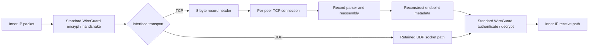
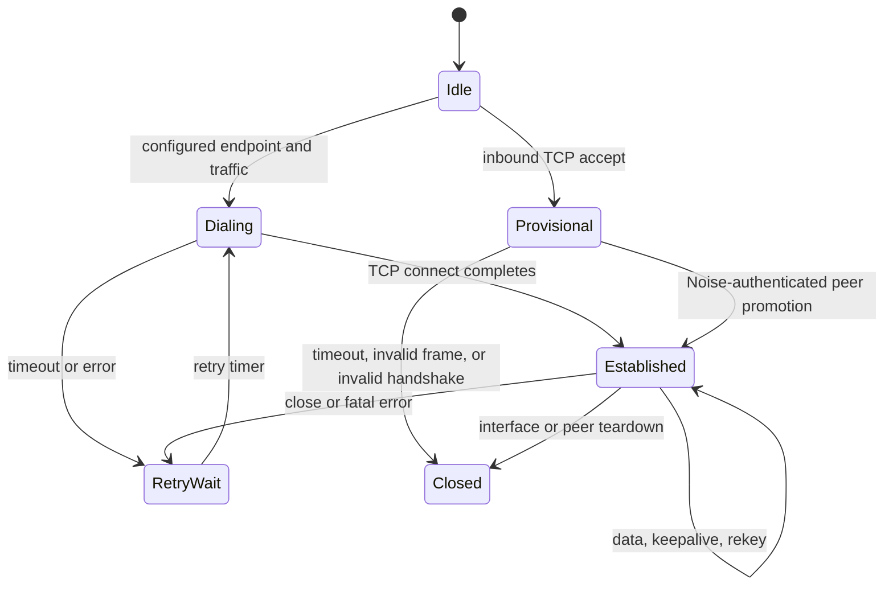

# WireGuard TCP Transport Design

## Document status

| Field | Value |
|---|---|
| Implementation snapshot | `jnathan/naked_gun@4211b00ef437`, imported into this repository |
| Scope | Linux kernel module, Linux generic-netlink control path, modified `wg` tools |
| Maturity | Experimental research prototype |
| Default transport | UDP |
| TCP interoperability | Requires this extension at both endpoints |

This document separates four kinds of statements:

- **Implemented** describes behavior present in this source snapshot.
- **Required for parity** describes work needed to claim backward-compatible,
  production-quality WireGuard behavior in TCP mode.
- **Measured** describes output published by the repository's performance
  campaign. It does not imply a general performance guarantee.
- **Inferred** describes a hypothesis suggested by measured output but not yet
  established causally.

## Executive summary

The extension adds an interface-wide transport selector below WireGuard's
existing cryptographic protocol. In UDP mode, packets follow the retained
WireGuard UDP transport branch. In TCP mode, the same WireGuard handshake,
keepalive, and encrypted data messages are placed into length-delimited records
on a long-lived TCP connection. The receive side removes the record header and
feeds the common WireGuard receive pipeline. This snapshot changes UDP-visible
listen-port and cookie-under-load behavior, so retaining the branch does not yet
establish stock behavioral parity.

The design deliberately does not define a new VPN cryptographic protocol. Noise
handshakes, peer public keys, preshared keys, key rotation, replay protection,
AllowedIPs, and inner-packet authentication remain WireGuard concerns. TCP is an
outer carrier and supplies connection state, ordered delivery, congestion
control, and retransmission.

UDP remains value zero and a fresh interface uses it when `Transport` is absent.
On an existing interface, omission leaves the current mode unchanged. This
preserves configuration at the selection layer, but it is not automatic
protocol fallback. TCP peers do not interoperate with stock UDP-only WireGuard
peers on the same interface. Mixed transports require separate WireGuard
interfaces.

The code contains a foundation for endpoint roaming: it accepts an inbound TCP
connection before its peer identity is known and processes the normal WireGuard
handshake. Its intended post-authentication promotion path currently has unsafe
ownership and RCU handling. Full roaming parity is not complete in this
snapshot; reconnect targeting, asymmetric ports, local route changes,
dual-stack listeners, network namespaces, and connection-collision handling
require additional work.

## Goals

1. Carry standard WireGuard messages over raw TCP when UDP is unavailable or
   operationally undesirable.
2. Keep the existing UDP data path available and selected by default.
3. Reuse WireGuard keys, Noise handshakes, AllowedIPs, replay protection,
   keepalives, rekey timers, and peer statistics.
4. Support initiator, responder, NATed, endpoint-learning, and roaming roles in
   TCP mode without trusting an address before cryptographic authentication.
5. Integrate outer-TCP flow control without blocking softirq or WireGuard crypto
   workers.
6. Make nested-TCP behavior observable and bounded so congestion cannot cause
   unbounded kernel queues or silent stalls.

## Non-goals

- Making a TCP-mode peer wire-compatible with a stock UDP-only peer.
- Disguising the stream as HTTP, TLS, or another application protocol.
- Claiming TCP is universally faster than UDP.
- Replacing WireGuard authentication or encryption with TCP security.
- Guaranteeing that a single reliable byte stream can eliminate head-of-line
  blocking across unrelated inner flows.

## Architecture



The selector is stored on `struct wg_device`, so every peer on one interface
uses the same carrier. The UDP implementation remains present and the send path
branches immediately before outer transport transmission. See
[`device.h`](../kernel/device.h#L62-L90),
[`device.c`](../kernel/device.c#L37-L77), and
[`socket.c`](../kernel/socket.c#L1200-L1282).

### Control plane

The UAPI adds two values and one device attribute:

```c
#define WG_TRANSPORT_UDP 0
#define WG_TRANSPORT_TCP 1

enum wgdevice_attribute {
    /* existing attributes retain their numbers */
    WGDEVICE_A_PEERS,
    WGDEVICE_A_TRANSPORT,
};
```

`WGDEVICE_A_TRANSPORT` is appended after the stock attributes and encoded as
`NLA_U8`; the generic-netlink family remains version 1. The kernel returns the
value on device dumps. The modified Linux `wg` tool sends the attribute only
when its separate `WGDEVICE_HAS_TRANSPORT` flag is set. References:

- [`include/uapi/linux/wireguard.h`](../include/uapi/linux/wireguard.h#L131-L166)
- [`kernel/netlink.c`](../kernel/netlink.c#L29-L39)
- [`kernel/netlink.c`](../kernel/netlink.c#L525-L531)
- [`tools/containers.h`](../tools/containers.h#L69-L92)
- [`tools/ipc-linux.h`](../tools/ipc-linux.h#L469-L483)

The configuration file key is interface-wide and case-insensitive:

```ini
[Interface]
PrivateKey = <private-key>
ListenPort = 51821
Transport = tcp

[Peer]
PublicKey = <peer-public-key>
AllowedIPs = 10.0.0.2/32
Endpoint = peer.example.net:51821
PersistentKeepalive = 25
```

The equivalent direct command is:

```bash
wg set wg0 listen-port 51821 transport tcp
```

Both endpoints need the modified kernel and must select the same transport.
TCP mode requires a nonzero effective `ListenPort`. This fork currently
initializes every new interface to port 51820, including UDP interfaces, rather
than preserving stock WireGuard's random-port behavior. Configure the port
explicitly. Configure the transport while the interface is down and bring it up
afterward; live mode switching does not rebuild all listener and peer state in
this snapshot.

For the current static topology, both peers need bidirectional inbound TCP
reachability or port forwarding on matching configured ports. The handshake
path can initiate a reverse connection instead of replying solely on the
accepted stream, so conventional one-sided client-behind-NAT behavior is not
established. Apply the transport as a separate direct `wg set` operation
without repeating the private key, then verify it: an unchanged private-key
attribute currently jumps over transport assignment in the kernel SET path.

### TCP record format

TCP does not preserve message boundaries, so each WireGuard message is wrapped
in a small record:

| Offset | Size | Field | Meaning |
|---:|---:|---|---|
| 0 | 4 | `length` | Big-endian total record length, including this header |
| 4 | 1 | `type` | Record type; current data path uses `0` |
| 5 | 1 | `flags` | Bit 0 indicates a fragment metadata header |
| 6 | 2 | `checksum` | Framing checksum over length, type, and flags |
| 8 | 0 or 4 | fragment metadata | IPv4 ID and fragment offset when flag bit 0 is set |
| 8 or 12 | variable | payload | Unmodified WireGuard message |

The definitions are in [`socket.h`](../kernel/socket.h#L36-L58). The checksum
is an XOR/rotate discriminator with a fixed constant, implemented in
[`socket.c`](../kernel/socket.c#L3222-L3251). It helps locate record boundaries;
it is not a MAC and must never be treated as authentication. Only the enclosed
WireGuard message receives cryptographic authentication.

### Transmit path

1. The normal WireGuard path selects a peer by AllowedIPs, creates or refreshes
   its Noise session, encrypts the inner packet, and produces a standard
   WireGuard message.
2. UDP mode calls the existing IPv4 or IPv6 UDP tunnel transmitter.
3. TCP mode selects the peer's active stream, prepends the record header and
   optional fragment metadata, and uses a nonblocking `kernel_sendmsg`.
4. A full socket buffer returns `EAGAIN`; `sk_write_space` schedules a per-peer
   worker to continue draining queued records when the TCP stack has room.
5. `TCP_NODELAY` is enabled on accepted and outbound sockets to avoid Nagle and
   delayed-ACK latency amplification.

The record write path is in
[`socket.c`](../kernel/socket.c#L1114-L1262), and callback-driven draining is in
[`socket.c`](../kernel/socket.c#L3383-L3505) and
[`socket.c`](../kernel/socket.c#L4273-L4325).

### Receive path

1. `sk_data_ready` schedules a per-peer read worker instead of performing
   blocking stream I/O in the socket callback.
2. The worker accumulates arbitrary TCP chunks until an entire record is
   available.
3. It checks the framing checksum, handles an optional fragment header, and is
   designed to preserve leftover bytes when one receive contains multiple
   records. The current parser does not yet enforce all required length, type,
   and flag bounds.
4. It reconstructs synthetic IP and UDP headers from the TCP socket's endpoints.
   This lets the existing WireGuard receive code obtain endpoint metadata and
   reuse the normal handshake/data dispatch.
5. The standard WireGuard pipeline authenticates the handshake or AEAD data,
   performs replay checks, applies AllowedIPs, updates timers, and only then
   delivers the inner packet.

See [`socket.c`](../kernel/socket.c#L3850-L4209),
[`socket.c`](../kernel/socket.c#L3650-L3846), and
[`receive.c`](../kernel/receive.c#L908-L960).

## Target connection lifecycle



This diagram is the intended lifecycle, not a claim that every transition is
complete. In this snapshot, provisional cleanup scheduling is compiled out,
invalid frames and failed handshakes do not reliably close the stream, and
there is no active unauthenticated-handshake deadline. A provisional socket can
therefore persist until TCP or interface teardown.

### Outbound connections

The module creates a nonblocking kernel TCP socket, installs its callbacks,
starts `kernel_connect`, and arms a retry worker. State changes update
`tcp_pending`, `tcp_established`, inbound/outbound direction flags, and
timestamps. A close schedules cleanup and a later reconnect when no usable
direction remains. See [`socket.c`](../kernel/socket.c#L2471-L2693),
[`socket.c`](../kernel/socket.c#L2792-L2984), and
[`socket.c`](../kernel/socket.c#L4462-L4503).

### Inbound connections and identity

An address is not a WireGuard identity. The listener therefore accepts a TCP
connection from an unknown source into a temporary peer object. That object has
only the stream parser, queues, callbacks, and enough device context to process
a WireGuard handshake. After Noise authenticates and maps the handshake to a
configured public key, the design intends to promote the socket to the real
peer. This is the right architectural basis for responder-only peers, NAT, and
roaming, but the current promotion block has unsafe temporary-peer ownership
and RCU lifetime handling. It is an intended path rather than a
production-ready capability.

The provisional accept path is in
[`socket.c`](../kernel/socket.c#L1959-L2151). Handshake identity resolution and
promotion are in [`receive.c`](../kernel/receive.c#L487-L610).

### Concurrency model

Each real or temporary peer owns read/write work items, scheduling locks, TCP
state locks, and a send queue. Socket callbacks remain short; stream reads and
writes run on workqueues. Pending accepted sockets are held on a device list
protected by a spinlock and RCU operations. See
[`peer.h`](../kernel/peer.h#L60-L116) and
[`socket.c`](../kernel/socket.c#L4506-L4700).

## Backward compatibility contract

### Implemented behavior

| Combination | Result |
|---|---|
| Modified tool + modified kernel, no `Transport` | Existing mode is not explicitly changed; a new device starts as UDP |
| Modified tool + modified kernel, `Transport = udp` | Retained UDP send branch is selected; stock cookie/port parity is not complete |
| Modified tool + modified kernel, `Transport = tcp` | TCP record transport is selected for the entire interface |
| Stock-style config on modified tool/kernel | Existing keys remain valid; omission gives UDP on a fresh device and preserves the current mode on an existing one |
| Stock tool + modified kernel | Ordinary control is unproven; the kernel includes the new attribute in every device dump |
| Modified tool + stock kernel, transport omitted | Expected compatibility path because no new SET attribute is sent; regression testing required |
| Modified tool + stock kernel, explicit TCP or UDP | Unsupported because the stock kernel does not know the new SET attribute; TCP must produce a clear capability error |
| Stock peer opposite a TCP interface | No interoperability; there is no transport negotiation |
| TCP and UDP peers on one interface | Not supported; use two interfaces |

The compatibility intent comes from appending the UAPI attribute, retaining the
existing family version, assigning UDP value zero, and having the modified tool
omit the attribute from SET requests unless `WGDEVICE_HAS_TRANSPORT` is set.
The modified kernel does emit the attribute in device dumps, so compatibility
with every old-tool/new-kernel combination has not been established.

### Required for production compatibility

1. **Validate the enum.** Reject transport values other than UDP and TCP.
2. **Make transitions transactional.** A live UDP-to-TCP or TCP-to-UDP change
   must create the new listeners and peer state before committing the mode, then
   tear down the old carrier. Until then, require link-down configuration.
3. **Preserve stock port semantics.** TCP must support `ListenPort = 0` and an
   omitted random listen port, or return an explicit capability error before
   link-up. The current TCP listener rejects port zero, while this fork defaults
   all new interfaces, including UDP, to port 51820 instead of a stock-style
   random port.
4. **Round-trip configuration.** `wg showconf` must emit `Transport`, not
   `TransportMode`, and UDP/TCP must survive `showconf`, `setconf`, `syncconf`,
   and `wg-quick SaveConfig`.
5. **Complete tooling.** Update `wg(8)`, shell completion, stable show selectors,
   and script output without changing existing columns unexpectedly.
6. **Capability detection.** A modified tool should distinguish an old kernel
   with no transport attribute from explicit UDP and give a precise error only
   when TCP was requested.
7. **Preserve routing semantics.** Apply `FwMark` to TCP sockets so full-tunnel
   policy routing cannot feed the outer TCP connection back into the tunnel.
8. **Preserve network namespaces.** Create and route TCP sockets in the device's
   namespace rather than `init_net`.
9. **Adjust MTU accounting.** Include TCP/IP plus the 8-byte record overhead in
   automatic MTU selection and test fragmentation for IPv4 and IPv6.
10. **Keep secrets out of output.** Remove unconditional Linux IPC packet dumps;
    SET messages can contain private and preshared keys.
11. **Restore UDP handshake behavior.** Match stock cookie/MAC and under-load
    rate-limit decisions before claiming that omitted transport is a behavioral
    no-op.
12. **Document the public UAPI.** Add `WGDEVICE_A_TRANSPORT` to the normative GET
    and SET attribute trees with its `NLA_U8` type, values, device-wide scope,
    dump presence, and SET omission semantics for third-party controllers.

Current examples of these gaps are visible in
[`showconf.c`](../tools/showconf.c#L52-L69),
[`netlink.c`](../kernel/netlink.c#L832-L909),
[`socket.c`](../kernel/socket.c#L2349-L2354),
[`socket.c`](../kernel/socket.c#L2550-L2668), and
[`ipc-linux.h`](../tools/ipc-linux.h#L451-L483).

## Roaming and endpoint mobility

WireGuard roaming means that peer identity is stable while the observed network
endpoint can change. A valid packet from the peer's key may update the endpoint;
the address itself never authenticates the peer.

### Implemented foundation

- Handshake initiation and response update the endpoint only after Noise maps
  the message to a configured peer.
- Successfully decrypted data follows the stock authenticated endpoint-learning
  hook.
- Unknown inbound TCP addresses are admitted provisionally; an intended
  post-authentication promotion path exists but is currently unsafe.
- Route cache state is reset when an endpoint changes.
- Existing keepalive and rekey timers operate above the transport selector.

References:
[`receive.c`](../kernel/receive.c#L487-L536),
[`receive.c`](../kernel/receive.c#L908-L935), and
[`socket.c`](../kernel/socket.c#L1408-L1472).

### Current parity status

| Scenario | Current status | Work needed for full parity |
|---|---|---|
| Static IPv4 endpoint | Basic path implemented | Soak, reconnect, and failure-injection tests |
| Static IPv6 endpoint | Code path exists | Fix dual-listener gating and run IPv6 campaign |
| Responder with newly observed source | Temporary-peer path exists | Fix promotion lifetime/RCU issues and bound provisional resources |
| NAT with persistent keepalive | Standard timer retained | Validate long-lived TCP NAT behavior and half-open detection |
| Peer IP changes | Inbound promotion intent exists | Update future dial target after authenticated roam |
| Peer source port changes | Observed by accepted socket | Keep ephemeral source separate from remote listen port |
| Asymmetric listen ports | Not robust | Preserve configured peer port; never replace it with the local port |
| Local uplink/address changes | Not robust | Route/address notifiers and socket reconnect in the correct namespace |
| Simultaneous inbound/outbound connect | Both directions tracked | Deterministic collision winner and graceful old-stream drain |
| Mixed TCP/UDP peers | Not supported per interface | Separate interfaces, or a future per-peer UAPI revision |

The current code freezes `peer_endpoint` on its first assignment and later dials
that address. It also replaces a learned remote port with the local interface's
listen port. Those choices assume stable addresses and equal listen ports, so
they must be corrected before full roaming is claimed. See
[`socket.c`](../kernel/socket.c#L1450-L1469) and
[`socket.c`](../kernel/socket.c#L2507-L2541).

### Target roaming algorithm

1. Accept a TCP stream into a small, rate-limited provisional object with a
   handshake deadline and strict byte/frame limits.
2. Permit only valid WireGuard handshake records before peer authentication.
3. Let Noise map the handshake to a configured public key.
4. Split endpoint state into:
   - live TCP 4-tuple,
   - last authenticated remote IP/family,
   - configured remote listen port,
   - last valid local route/source,
   - current active connection generation.
5. Atomically promote the socket to the peer. A deterministic rule based on
   connection generation and peer keys must resolve simultaneous connections.
6. Update the dial IP only from an authenticated message. Preserve the configured
   peer listen port unless an authenticated protocol extension explicitly
   advertises a replacement.
7. Drain and retire the old stream without discarding valid Noise keypairs.
8. On local route/address changes, discard stale source state and reconnect via
   the current route in the device's namespace.
9. Keep `PersistentKeepalive`, rekey, replay, and AllowedIPs semantics unchanged.

## Security model

### Preserved properties

- Peer identity is still a WireGuard public key.
- Handshake and data authentication remain Noise and ChaCha20-Poly1305 concerns.
- Replay counters and AllowedIPs validation remain in the common receive path.
- TCP framing does not weaken or replace the WireGuard cryptographic envelope.

### New attack surface

TCP adds unauthenticated connection state before a WireGuard identity is known.
The implementation must defend memory, CPU, workqueue, and file-descriptor
resources before Noise authentication.

Required controls include:

- Enforce `8 <= record_length <= WG_MAX_PACKET_SIZE`, valid fragment minimums,
  known type/flag values, and per-connection buffered-byte limits before
  allocation.
- Bound every send queue used by normal traffic and define a drop policy that
  allows inner transports to observe congestion.
- Make partial writes record-safe. Retrying an untouched or partially consumed
  record must not duplicate bytes or insert a second header mid-record.
- Enable expiry of provisional connections and cap provisional objects per
  device and source prefix.
- Restore an equivalent to WireGuard's cookie/rate-limit protection. The current
  TCP-mode receive path bypasses cookie validation at the device level. Because
  the interface still opens its normal UDP sockets, UDP-delivered handshakes to
  a TCP-mode interface also bypass that inexpensive cookie/MAC screening.
- Restore stock UDP under-load cookie decisions as well; the retained UDP branch
  currently changes the no-cookie decision even when TCP mode is not selected.
- Fix temporary-peer promotion ownership and RCU lifetime before enabling roaming
  in hostile networks.
- Reschedule the read worker when its 64-record budget is exhausted but buffered
  or socket data remains. The current worker clears its scheduled flag without
  a final readiness check, which can leave a busy stream stalled.
- Keep verbose packet/key diagnostics disabled outside an isolated lab. They are
  off by default, but verbose code can expose sensitive material.
- Remove unconditional userspace IPC dumps, which can expose key-bearing
  netlink messages and corrupt machine-readable command output in either mode.

These are design-closure requirements, not optional optimizations. Relevant
current paths include [`receive.c`](../kernel/receive.c#L421-L484),
[`socket.c`](../kernel/socket.c#L1114-L1240),
[`socket.c`](../kernel/socket.c#L3626-L3645), and
[`socket.c`](../kernel/socket.c#L3953-L4028).

## TCP-over-TCP behavior and meltdown resilience

### The risk

When an inner TCP flow crosses an outer TCP stream, both layers implement
reliability, ordering, retransmission timers, and congestion response. Loss of
one outer segment blocks delivery of later bytes even when they contain packets
for unrelated inner flows. If outer recovery is slow enough for inner TCP to
time out, both layers can retransmit and reduce their windows. Queue growth and
repeated timeouts are commonly called TCP-over-TCP meltdown.

No design using one reliable ordered stream can make this risk disappear. The
goal is bounded, observable degradation and a clear choice to retain UDP where
its datagram semantics are preferable.

The observed application tests motivate a more specific working hypothesis:
severe meltdown may occur under a narrower set of conditions than initially
expected from broad warnings about any TCP-over-TCP construction. It likely
requires a particular conjunction of outer loss or congestion, head-of-line
blocking, enough multiplexed inner traffic and queue growth, and recovery delays
long enough to trigger harmful interaction between the inner and outer
retransmission timers. The current campaign does not locate those boundaries,
but its lack of an obvious collapse makes that narrower-condition hypothesis
worth testing.

### Implemented properties that can help

- Linux TCP provides the outer congestion controller, SACK/DSACK behavior when
  negotiated by the host stack, retransmission, pacing, and receive-window
  backpressure.
- `TCP_NODELAY` avoids Nagle/delayed-ACK amplification for small WireGuard
  records.
- Nonblocking writes and `sk_write_space` callbacks keep WireGuard workers from
  sleeping behind a full outer socket.
- Per-peer connections isolate different peers, although all inner flows for one
  peer still share one ordered stream.
- Record framing is designed to reassemble TCP segmentation/coalescing and the
  parser can retain multiple records from one receive on full-write paths. The
  current short-write cursor bug can still corrupt record boundaries.
- Connection close/error callbacks schedule cleanup and reconnect.
- Optional diagnostics expose cwnd, ssthresh, RTT, RTO, retransmission state,
  socket memory, and queue pressure. See
  [`socket.c`](../kernel/socket.c#L73-L337).

The module does **not** implement a custom adaptive congestion controller,
four-zone tuning, custom DSACK logic, or coordination between inner and outer
TCP timers. References to such features in the historical test plan are not
backed by symbols in this source snapshot.

### Required but not yet implemented resilience controls

1. **Record-safe backpressure:** maintain an explicit cursor for header and
   payload bytes across short writes.
2. **Bounded memory:** cap packets and bytes per peer, device, and provisional
   connection; export drops and high-water marks.
3. **Congestion signaling:** prefer an intentional early drop policy over an
   unbounded queue so inner TCP can react before memory and latency explode.
4. **Fair scheduling:** prevent one inner flow from monopolizing a peer stream.
   A future multi-lane protocol may isolate flow classes, but it requires an
   explicit interoperable framing revision.
5. **Stall detection:** combine forward-progress time, `TCP_INFO`, queue age,
   and keepalive state to close a stream that is alive but no longer useful.
6. **Connection limits:** rate-limit accepts and expire unauthenticated streams.
7. **Observability:** export retransmits, cwnd, RTT/RTO, send/receive queue age,
   partial writes, parser resyncs, reconnects, and per-peer drops.
8. **UDP escape hatch:** keep UDP the default and support separate UDP/TCP
   interfaces so operators can choose datagram semantics for latency-sensitive
   or highly multiplexed traffic.

## Performance evidence

### Published campaign

The published report describes eight isolated two-vCPU Azure VM pairs across
x64 and arm64, four latency tiers, TCP and UDP WireGuard interfaces, four
workload families, eight configured loss values from 0% to 20%, and nominally
three runs per cell. Bulk TCP uses four parallel streams, bulk UDP is capped at
1 Gbps, and loss injection is iid random. Applications also included short
HTTPS, HTTP/2, and ICMP/SSH-oriented interactive tests. See
[`perf-test/REPORT.md`](../perf-test/REPORT.md#L1-L38).

The reported output is surprising:

| Published example | TCP-WG | UDP-WG |
|---|---:|---:|
| LAN x64 bulk TCP, clean | 2789.4 Mbps | 2588.2 Mbps |
| LAN x64 bulk TCP, configured 10% loss | 2751.2 Mbps | 28.8 Mbps |
| HIGH x64 bulk TCP, clean | 244.8 Mbps | 286.1 Mbps |
| HIGH x64 bulk TCP, configured 10% loss | 463.9 Mbps | 0.7 Mbps |
| LAN x64 short HTTPS, configured 10% loss | 154.54 req/s | 6.01 req/s |

The same tables show a mixed clean-link cost: TCP-WG is ahead in several LAN and
medium-distance bulk cells, but x64 is 14% behind at the clean HIGH tier and 23%
behind at the clean MAX tier. Published TCP-WG ICMP loss is zero throughout the
configured loss sweep while UDP-WG approximately follows the configured value.

### Provisional inference

The defensible interpretation is:

> No classic throughput collapse is visible in the published application
> tables, including the 60-second bulk runs, under this campaign's configured
> WireGuard-interface impairment. These empirical application-level Azure
> results are consistent with the hypothesis that severe TCP-over-TCP meltdown
> occurs under a narrower set of conditions than initially expected from common
> worst-case warnings.

That is an interesting result and a reason to test the hypothesis directly. It
does not identify the necessary or sufficient conditions, and it is not proof
that the outer TCP carrier is generally meltdown-resilient.

### Why it is not an outer-loss proof

The executable harness applies `tc netem` to `wg-tcp0` or `wg-udp0` for tunneled
cases, not to the physical carrier interface:
[`run-cell.sh`](../perf-test/harness/run-cell.sh#L41-L72). The test plan also
describes this as tunnel-internal loss:
[`TESTPLAN.md`](../perf-test/TESTPLAN.md#L182-L189). This conflicts with wording
in the generated report that calls it carrier-link loss.
The harness installs that qdisc only on the client VM/interface, so impairment
was one-sided despite stale test-plan language about both directions.

Consequences:

- Outer TCP segment loss, retransmission, reordering, and cwnd recovery were not
  demonstrably exercised.
- The campaign does not isolate whether the TCP path recovered, bypassed, or
  experienced a different impairment at the WireGuard qdisc.
- Saved artifacts do not include enough qdisc or outer-TCP retransmission data to
  establish a causal explanation.
- Some report/matrix counts and stale topology labels conflict, and the raw cell
  directory is not present for independent regeneration.
- Short-transfer cells can contain up to 600 GETs across three sizes, high-loss
  cells may be partial after the 360-second cap, and the web mix can retry at a
  lower concurrency. A published MAX-arm 0.5% short-transfer cell also has a
  very large spread (69.09 +/- 118.40 requests/s). These details limit direct
  comparison between every reported cell.

There is also negative stability evidence: the report records an arm64,
high-latency, configured 10-20% loss workload that wedged the VM network stack
until reboot; a 360-second workload ceiling avoided the condition rather than
demonstrating a fix. See
[`REPORT.md`](../perf-test/REPORT.md#L493-L514).

### Required meltdown validation

A release claim should require a new, reproducible campaign that:

1. Applies impairment to the physical outer interface and verifies it with
   before/after qdisc counters.
2. Separates random non-congestive loss, burst loss, reordering, delay, bandwidth
   bottlenecks, and finite queue congestion.
3. Captures outer `TCP_INFO`, cwnd, RTT/RTO, SACK/retransmits, socket memory, and
   per-record queue age alongside inner-flow metrics.
4. Tests one and many inner TCP/UDP flows, short requests, interactive traffic,
   flow fairness, and cross-flow head-of-line blocking.
5. Includes blackouts longer than inner and outer RTOs, route changes, reconnect,
   rekey, and endpoint roaming.
6. Runs multi-hour soaks without workload time caps hiding a stall.
7. Stores raw cells, exact scripts, kernel/tool commits, qdisc configuration,
   and aggregate code so every table can be regenerated.
8. Defines failure thresholds for queue growth, latency, kernel warnings, lost
   connectivity, and required reboot, not throughput alone.

## Benefits analysis

| Potential benefit | Best fit | Cost or condition |
|---|---|---|
| Connectivity where UDP is blocked | Networks that permit raw TCP to the configured port | This is not HTTP/TLS camouflage and may still be blocked by policy or DPI |
| Reuse of WireGuard identity and crypto | Operators wanting the same keys, peers, AllowedIPs, rekey, and keepalives | Both endpoints need the modified Linux implementation |
| Outer loss recovery | Non-congestive carrier loss where ordered reliable delivery is valuable | Can add latency and head-of-line blocking; current campaign does not validate this path |
| Reliable delivery for inner UDP | Bulk or transactional UDP where completeness matters more than timeliness | Changes datagram loss semantics; late data may be worse than dropped data for real-time media |
| Long-lived connection through stateful policy | TCP-friendly firewalls/NATs | Requires connection limits, keepalive validation, and half-open detection |
| Operational choice | Separate TCP and UDP interfaces can serve different routes | Mode is device-wide, with additional configuration and resource cost |

### Recommended transport choice

| Situation | Recommendation |
|---|---|
| UDP works and lowest latency/simple state is the priority | Use UDP |
| UDP is blocked but raw TCP is allowed | Evaluate TCP mode in a controlled deployment |
| Real-time UDP prefers timely loss over delayed recovery | Prefer UDP |
| Random-loss bulk/transactional traffic | Benchmark both modes on the actual path |
| Many unrelated inner flows share one peer | Treat TCP mode as experimental until fairness and queue bounds are complete |
| Production full-tunnel policy routing, roaming, or namespace-heavy use | Complete the parity items in this document first |

## Implementation map

| Area | Primary files |
|---|---|
| Transport UAPI | `include/uapi/linux/wireguard.h`, `tools/uapi/linux/linux/wireguard.h` |
| Kernel device selection | `kernel/device.h`, `kernel/device.c`, `kernel/netlink.c` |
| TCP framing and sockets | `kernel/socket.h`, `kernel/socket.c` |
| Handshake/data integration | `kernel/send.c`, `kernel/receive.c` |
| Peer TCP state | `kernel/peer.h`, `kernel/peer.c` |
| Tool parsing and netlink | `tools/config.c`, `tools/containers.h`, `tools/ipc-linux.h` |
| Display/config output | `tools/show.c`, `tools/showconf.c` |
| Performance methodology | `perf-test/TESTPLAN.md`, `perf-test/harness/`, `perf-test/REPORT.md` |

## Design closure checklist

TCP mode can be described as backward-compatible and at WireGuard feature parity
only after all of the following are true:

- [ ] UDP mode passes stock-compatible configuration and data-path regression
      tests with no new observable behavior when `Transport` is absent.
- [ ] Transport values, record sizes, flags, queues, and provisional connections
      are strictly validated and bounded.
- [ ] Partial writes and multi-record reads are stress-tested without stream
      corruption or stalls.
- [ ] Cookies/rate limits and unauthenticated resource controls protect TCP
      accepts before Noise authentication.
- [ ] Static, responder-only, NAT, persistent-keepalive, IP/port roaming,
      simultaneous connect, rekey, and reconnect scenarios pass for IPv4/IPv6.
- [ ] Remote dial IP, remote listen port, observed ephemeral source, and local
      route/source are represented separately.
- [ ] `FwMark`, MTU, network namespace, route-change, and random-port semantics
      match standard WireGuard expectations.
- [ ] `wg`, `showconf`, `syncconf`, `wg-quick SaveConfig`, man pages,
      completions, and stable script output round-trip both modes.
- [ ] No normal or diagnostic userspace output exposes private key material.
- [ ] Outer-loss, congestion, multi-flow fairness, roam, and long-soak campaigns
      are reproducible from committed raw data.
- [ ] No workload can wedge networking, grow queues without bound, or require a
      reboot to recover.

## Current deployment guardrails

For this snapshot:

1. Use it only in a controlled test environment.
2. Use Linux kernel-mode WireGuard at both ends.
3. Configure an explicit, nonzero, matching TCP listen port on both peers.
4. Set `Transport = tcp` before bringing the interface up.
5. Use separate interfaces when UDP fallback or mixed transport is required.
6. Do not rely on `wg-quick SaveConfig` for TCP interfaces until the
   `TransportMode`/`Transport` round-trip mismatch is fixed.
7. Do not assume full roaming, asymmetric-port, `FwMark`, namespace, or
   dual-stack parity.
8. Remove the unconditional userspace IPC dumps before using production keys or
   depending on machine-readable `wg` or `wg-quick` output. Keep optional kernel
   diagnostics off except during isolated debugging; `WG_TCP_DIAG` is
   unrate-limited and can perturb measurements.
9. Treat the published performance tables as leads for replication, not as a
   production SLA or proof of TCP-over-TCP meltdown immunity.
10. Provide bidirectional inbound TCP reachability on matching configured ports;
    do not assume ordinary one-sided NAT/responder behavior.
